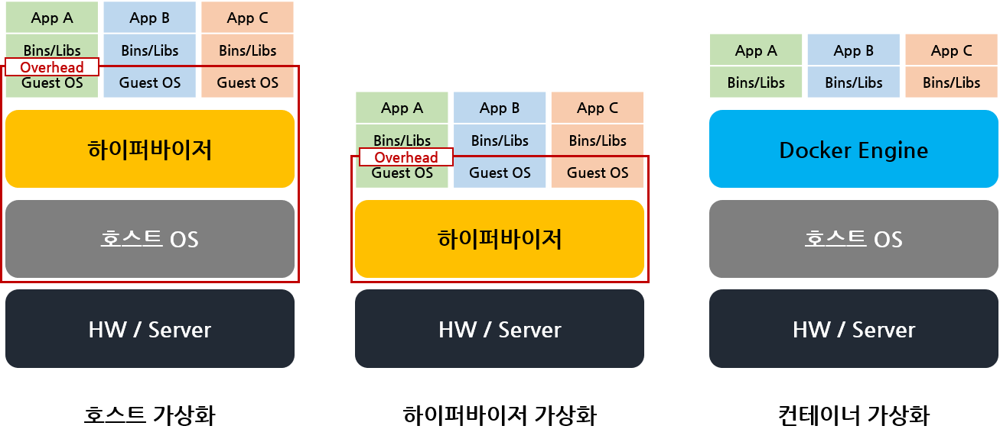

# Cloud 개념

>  Cloud 컴퓨팅과 특징, 서비스 유형(IaaS/Paas/Saas), 배치 모델 등에 대해서 알아보겠다.

## 클라우드 컴퓨팅 (Cloud Computing)

> 클라우드(인터넷)을 통해 가상화된 컴퓨터의 시스템 리소스를 요구하는 즉시 제공하는 것

- 쉽게 말해 *서버, 스토리지, DB, 네트워크, 애플리케이션, 서비스* 등의 자원이 필요할 때 인터넷을 통해 서비스 형태로 제공받아 이용하는 형식
- 아마존 AWS, 구글 GCP, 마이크로소프트 Azure 등

**장점**

- **유연한 IT 인프라 관리**: IT인프라를 실시간으로 자유롭게 조정 가능
- **신속한 인프라 도입**: IT인프라 도입에 들어가는 시간을 절감
- **예상치 못한 트래픽 폭주 대응**: 트래픽이 폭주할 경우 이것에 맞춰 재빨리 인프라를 늘릴 수 있음

## 클라우드 서비스 유형

> **IaaS**: Infrastructure as a Service / 인프라 자원을 서비스해줌
>
> **PaaS**: Platform as a Service / 플랫폼(개발에 필요한 환경)을 서비스해줌
>
> **SaaS**: Software as Service / 사용자가 원하는 소프트웨어를 서비스 해줌
>
> ------------
>
> **FaaS**: Function as a Service / 클라우드 공급자의 플랫폼에서 완벽하게 실행되는 서버리스 코드로 배포
>
> **CaaS**: Container as a Service / 컨테이너를 실행하는 가상서버, 컨테이너 구축/배포/모니터링 등 종합 도구 제공

    
    출처: http://cloudonmove.com

 

**On Premises**

- 기업이 자체적으로 데이터 센터를 보유하고 시스템 구축부터 운영까지 모두 수행하는 형태
-  클라우드가 등장하기 이전에 사용되었던 방식

**IaaS**

- 서버와 스토리지 같은 컴퓨터 자원을 제공하는 서비스
- CPU 코어의 개수, 메모리의 용량, 하드디스크 등의 컴퓨터 자원을 사용자가 원하는 형태로 제공
- 사용자는 직접 OS나 미들웨어를 설정하고 그 위에 실행되는 애플리케이션까지 사용자가 모두 만들어 사용
- ex) Amazon EC2, Google Computer Engine

**PaaS**

- 어플리케이션을 개발하거나 실행하기 위한 시스템 기능(플랫폼)을 서비스로 제공
- DB, 개발 프레임워크, 실행 시 필요한 라이브러리 및 모듈을 제공
- ex) Microsoft Azure, Coogle App Engine

**SaaS**

- 소프트웨어까지 모두 제공하는 서비스로 문서작성/표계산/이메일 등의 애플리케이션을 인터넷을 통해 제공하는 서비스
- ex) Microsoft Office 365, Google Apps 

 

**FaaS**

- 프로젝트를 한개 이상의 함수로 쪼개서 서버에 준비한 함수를 등록해두고, 이 함수들이 실행되는 횟수만큼 비용을 내는 방식

- 즉, 서버 인프라를 따로 관리하지 않고 함수를 실행하는데 필요한 컴퓨팅 자원을 작동한 만큼만 비용 지불

- 클라우드 공급자의 플랫폼에서 완벽하게 실행하는 서버리스 코드로 배포

  > **서버리스 (Serverless)**
  >
  > 서버가 없다는 의미지만 그냥 표현일 뿐 "서버의 존재에 대해 신경쓰지 않아도 된다"라는 의미
  >
  > 서버가 어떤 사양으로 돌아가고 있고, 갯수를 조절해야할지 등을 설정할 필요가 없다

- ex) AWS 람다, GCP function

**CaaS**

- 컨테이너를 실행하는 가상서버는 물론 컨테이너의 구축과 배포, 모니터링과 확장을 종합한 도구도 제공하는 것 *자세한 내용은 컨테이너를 다루는 글에서 소개하겠음*
- ex) AWS ECS

## 클라우드 서비스 운용 형태 (Private / Public / Hybrid)

> 클라우드는 서비스 운영 형태에 따라 퍼블릭 클라우드, 하이브리드 클라우드, 프라이빗 클라우드로 나눌 수 있다.

**Private Cloud**

- 기업이 직접 클라우드 환경을 구축하고 이를 기업 내무에서 활용하거나 계열사에 공개하는 것

- 외부 클라우드 사업자의 서비스를 이용하지 않고 서비스를 위한 인프라를 직접 구축한다는 점에서 온프레미스(자체 인프라 구축)과 동일하지만 약간 다름

  > **Private Cloud vs On-Premises**
  >
  > 차이점: 클라우드의 핵심 능력(**신속함**) 보유 여부
  >
  > 기업의 서비스에 사용자가 몰리면 **Private Cloud**는 해당 서비스를 위한 인프라를 증설해 빠르게 서비스를 안정화시킬 수 있다. 반면 **온프레미스**는 인프라를 새로 주문하고 이를 설치해 서비스에 연결할 때 까지 (보통 1~2주) 서비스를 안정화시키기 어렵다.

**Public Cloud**

- 외부 클라우드 사업자(Amazon, Google..)가 제공하는 서비스를 통해 클라우드를 이용하는 것
- 서비스를 위한 모든 인프라를 클라우드에서 제공받고, 필요한 때에 필요한 만큼의 클라우드 자원을 할당 받아 이용할 수 있음
- 필요한 서버를 즉시 생성하여 이용할 수 있고, 트래픽 및 자원 사용량 증가 시 바로 확장이 가능한 확장성, 서비스 비용으로 인한 경제성, 시스템 유지보수나 장애 대응을 위한 효율성을 장점으로 뽑을 수 있음

**Hybrid Cloud**

- Public Cloud + Private Cloud
- 보통 서비스 구동은 클라우드 상에서, 데이터 보관이나 로컬 서비스는 자체 인프라나 프라이빗 클라우드에서 처리하는 형태로 구현

 

## 클라우드의 핵심 기술

> 클라우드의 가장 큰 핵심인 **신속함**을 갖추기 위한 핵심기술을 소개하겠다

### 가상 서버 (가상 머신, VM)

하나의 물리적 서버를 논리적으로 나누어 CPU, 메모리 등의 자원을 할당 할 수 있다.

 

### 가상화 (Virtualization)

> 물리적인 하드웨어 장치를 논리적인 객체로 추상화하는 것으로, **하나의 하드웨어를 여러개처럼 동작시키거나 반대로 여러개의 장치로 묶어서 하나의 장치인 것 처럼 사용자에게 공유자원으로 제공하는 기술**

- 가상화의 대상이 되는 컴퓨팅 자원: CPU, Memory, Storage, Network 등

- 즉, 컴퓨팅 자원을 쪼개거나 합쳐서 자원을 더욱 효율적으로 사용할 수 있게하고, 분산처리가 가능

  

      
  

- **가상화의 종류**: 호스트 가상화, 하이퍼바이저 가상화, 컨테이너 가상화

  > **호스트 가상화**
  >
  > 하드웨어 위에 기본이 되는 호스트 OS를 설치하고, 호스트 OS에 가상화 소프트웨어를 설치하여 운영체제를 작동시키는 가상화 방식
  >
  > - 장점: 가상화 소프트웨어를 통해 손쉽게 가상화 환경 구축
  > - 단점: 호스트 OS위에서 게스트 OS를 작동시키기 때문에 **CPU메모리 사용이 증가하는 오버헤드 발생**
  >
  > **하이퍼바이저 가상화**
  >
  > HW 가상화를 전담하는 SW인 하이퍼바이저를 배치해 HW와 가상환경을 제어
  >
  > - 장점: 호스트가 없는 HW를 직접 제어하기 때문에 컴퓨팅 자원을 효율적으로 사용할 수 있음
  > - 단점: 환경별로 다른 OS가 작동해 **가상환경을 사용하기 위한 오버헤드 발생**
  >
  > **컨테이너 가상화**
  >
  > 운영체제에 논리적인 영역(**컨테이너**)를 만들고, 애플리케이션을 작동하는데 필요한 라이브러리와 애플리케이션 등을 컨테이너 안에 넣어, 마치 개별 서버처럼 사용하게 하는 기술로, Docker가 여기에 속한다

 

### 클러스터링 (Clustering)

여러개의 서버에 대량의 데이터를 분산으로 병렬 처리하는 방법으로, 여러 개의 서버를 결합해 하나의 큰 컴퓨터처럼 보이게 만드는 기술

대표적인 기술로 아파치 하둡(Apache Hadoop), 스파크(Spark)가 있음

 

### 서버리스 (Serverless)

클라우드 제공자가 동적으로 가상 머신 자원의 할당을 관리해 미리 설정된 서버리스 코드를 실행시키는 기술

컴퓨터 리소스와 관계없이 애플리케이션 개발이 가능한 **'이벤트 기반 클라우드 컴퓨팅 기술'**로 간편하게 네트워크에 접근이 가능하고, 데이터저장 및 다양한 기능을 제공해 비용을 효율적으로 관리할 수 있음

 

### 로드 밸런싱 (Load Balancing)

컴퓨터 자원을 분산하는 기술의 일종으로, 자세한 것은 [로드 밸런싱](https://github.com/lja9702/CS_for_noob/blob/noob/Network/load%20balancing.md) 참고

 

### 오토 스케일링 (Auto Scaling)

서비스가 집중되었을 때 서버 CPU 및 메모리 사용량이 일정 사용량을 초과하면 ***자동***으로 **가상 서버 대수를 증감(Scale in/out)**하거나 컴퓨팅 자원인 **CPU와 메모리 자원을 높이거나 낮추는(Scale up/down)**는 기능을 말한다.

 

---------------

### +) 하이퍼바이저란? 

호스트 컴퓨터 1대에서 다수의 OS를 동시에 실행할 수 있도록 해주는 가상 플랫폼기술로, 여러개의 OS가 단일 HW 호스트를 공유할 수 있도록 하는 프로그램이다.

하이퍼바이저의 역할은 높은 수준의 관리 및 모니터링 도구에 대한 인터페이스를 제공, OS간 서로 방해하지 못하도록 VM에대한 자원 및 메모리 할당 등을 처리한다.

  

출처 및 참고:

[https://hongku.tistory.com/101]()

[https://it.donga.com/27139/]()

[https://kim-dragon.tistory.com/5]()

[https://transferhwang.tistory.com/31]()