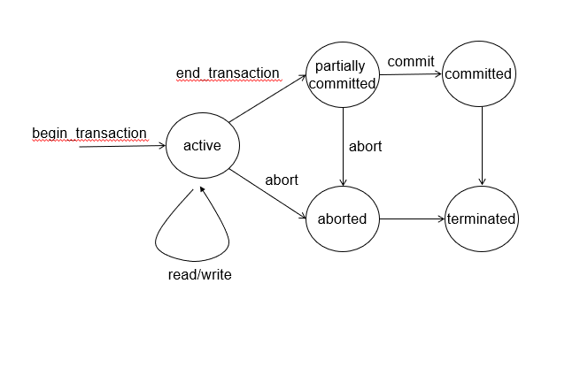

# 1. 트랜잭션 개념

- 트랜잭션은 하나의 논리적 작업을 수행하는 DB 연산의 순서

- 데이터베이스 프로그램의 수행(논리적) 단위

   

## Two main issues to deal with

1. HW/SW/Transaction failures → Recovery (회복기능)

2. Concurrency (동시성 제어 기능)

    

## 트랜잭션은 ACID 성질을 가져야 한다.

데이터베이스 무결성을 유지하기 위함

- **A**tomicity
  → 전체를 수행하거나 아예 안하거나

- **C**onsistency
  → 단일 트랜잭션 수행 시 데이터 무결정을 유지
  → 트랜잭션 시작 시 무결성제약을 만족하고 있으면 종료시에도 만족해야함
  → **하지만 수행 중간에는 만족하지 않을 수도 있다(끝에만 만족하면 됨)**

- **I**solation
  → 여러 트랜잭션이 동시 수행되어도 독립적으로 수행되게 느끼게끔

- **D**urability
  → 시스템 장애가 발생해도 시스템 상태에 변경사항이 반영되어야 함

   

## 트랜잭션의 직렬 실행

트랜잭션을 하나씩 처음부터 끝까지 수행하는 방식

→ 연산 간의 overlapping이 없어 고립성을 자연스럽게 만족시킴

→ **하지만 이러한 수행 방식은 성능이 좋지않아 실제 환경에서 적용 불가 (동시 실행이 안되므로)**

## 트랜잭션 상태

- Active

  → 트랜잭션이 실행 중일 때 가지는 상태

- Partially committed 

  → 마지막 명령문이 실행된 후의 상태

- Aborted - END

  → 트랜잭션이 취소되고 DB가 트랜잭션 시작 전 상태로 환원

- Committed - END

  → 성공적으로 완료된 상태
  
   

## 동시 실행

시스템은 다수 트랜잭션을 동시에 수행한다.

**장점**

1. 자원 활용성이 증가
2. 트랜잭션의 평균 응답 시간이 감소

 

## 트랜잭션 제어

트랜잭션 제어 언어는 TCL(Transaction Control Language)이라고한다.

- COMMIT : 트랜잭션 확정 (트랜잭션 메모리에 영구적으로 저장)
- ROLLBACK : 트랜잭션 취소 (트랜잭션 내역 무효화)
- CHECKPOINT : 저장 시기 설정 (ROLLBACK을 위한 시점 지정)