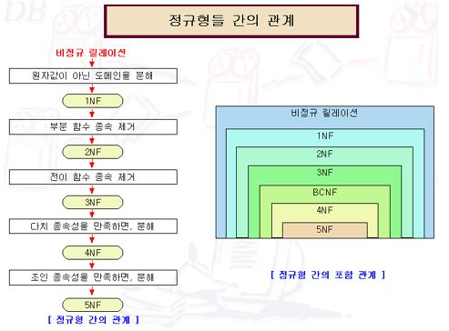

## 정규화

> 종속석 이론을 이용하여 잘못 설계된(anomaly) 관계형 스키마를 더 작은 속성으로 쪼개서 바람직한 스키마로 만들어가는 과정

### Anomaly

- #### Insert Anomaly (삽입 이상)

데이터 삽입 시 의도와는 상관없이 원하지 않는 값들도 함께 삽입

- #### Deletion Anomaly (삭제 이상)

튜플 삭제 시 의도와는 상관없는 값들도 함께 삭제되는 현상

- #### Update Anomaly (갱신 이상)

속성값 갱신 시 일부 튜플의 정보만 갱신되는 현상


### 함수 종속성

- #### 완전 함수 종속성 

```
α→β 외에도 α의 부분 집합인 γ이 γ→β 가 존재하지 않을 때 α는 β에 완전 의존적이다.
```

$$
α→β\,외에도\,\,α의\,부분\,집합인\,\,γ로 \,\,γ→β \,\,가 \,존재하지 않을 \,때\,\,\,\,\,\, α는\, β에 \,완전\, 의존적이다.
$$

- #### 부분 함수 종속성

$$
α→β\,외에도\,\,α의\,부분\,집합인\,\,γ로 \,\,γ→β \,\,가 \,존재하는 \,경우\,\,\,\,\,\, α는\, β에 \,부분적으로\, 의존적이다.
$$

- #### 이행 함수 종속성

> 암스트리 공리의 이행 규칙을 이용하여 생성되는 함수 종속성

$$
α→β,\, β→γ \,\,가 \,존재하는 \,경우\,\,\,\,\,\, γ는\, α에 \,이행적으로\, 의존적이다.
$$


### 정규화 과정



- #### 1NF

속성 값으로 원자 값(atomic)만 허용

- #### 2NF

1NF만족 + 비주요 속성이 후보키에 대해 완전 함수적 종속을 만족해야함 

- #### 3NF

2NF만족 + 비주요 속성이 모든 후보키에 이행적 종속을 만족하지 않아야 함

 α→β에서   α가 슈퍼키 이거나  β가 주요 속성이어야함

- #### BCNF

모든 의미 있는 함수 종속성 α→β 에서 α가 슈퍼키이어야 함

- #### 4NF

다치 종속  α→β가 성립하는 경우 모든 속성이   α에 대해 함수적 종속을 만족해야 함

- #### 5NF

모든 조인 종속이 후보키를 통해서만 성립되어야 함