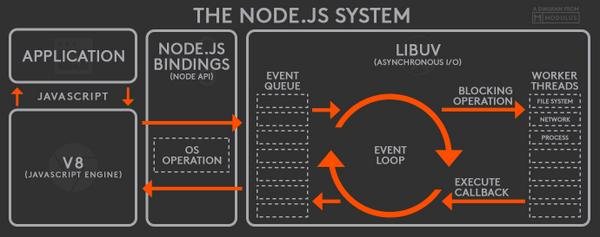

# Node.JS

> 2009년 Ryan Dahl이 발표한 언어로, 구글의 V8 JavaScript 엔진을 기반으로 한다. **JavaScript**를 활용하며 **Non-blocking I/O** 와 **싱글 스레드 이벤트 루프**를 통해 높은 처리 성능을 가지는 것이 특징이다.

## 특징 및 핵심 키워드

- 싱글스레드 이벤트 루프 (*이벤트 루프만 싱글스레드이며, io처리를 하는 워커는 멀티스레드이다*)
- 비동기 I/O 처리 (Non-Blocking I/O)
- 내장 HTTP 서버 라이브러리 포함
- 자바스크립트
- 풍부한 라이브러리(모듈) 제공
- 단점: 비동기방식이다보니 로직이 복잡하면 콜백함수의 늪에 빠질 수 있다.

 

## 싱글스레드 이벤트 루프 기반 비동기 방식 

    
    출처: https://gocoder.tistory.com/1577

백화점 푸드코트를 생각하면 편하다. 하나의 카운터(Thread)에서 여러 입점사들의 음식을 보고 선택을 한뒤, 해당 요리에 해당하는 입점사 식당에 주문이 들어간다 (Event).

=> 입력은 하나의 스레드에서 받지만 순서대로 처리하지 않고 먼저 처리된 결과 값을 반환해줌

**정리**

- 싱글 스레드 기반의 이벤트루프가 계속 돌면서 요청을 처리

- **이벤트 루프만 싱글 스레드여서 req, res가 싱글스레드, 뒤에서 일하는 워커(io처리)는 멀티스레드**

- 하나의 스레드가 요청을 받으면, 바로 다음 처리에 요청을 보내놓고 다른 작업을 처리하다 요청한 작업이 먼저 끝나는 이벤트를 받아 응답을 보냄

- 동시에 요청이 와도 처리가 완료될 때 까지 기다리지 않아도 되기 때문에 서버 부하가 적다 

- 싱글 스레드로 여러 요청을 받는 것은 **멀티플렉싱**으로 해결한다고 한다

  > **멀티플렉싱**
  >
  > 하나의 프로세스로 여러개의 요청을 처리하는 것으로, select 함수를 이용해 구현할 수 있다

 

## 기존 웹서버와 다른점

**Apache**

- 웹 리소스가 요청될 때마다, 요청을 처리하기 위해 별도의 스레드를 생성하거나 새 프로세스를 호출
- 요청이 많은 경우 병목이 발생하는데, 로직보다는 IO에서 문제가 발생하는 경우가 많음
- 동기 방식에서 이를 해결하기 위해 흔히 멀티스레드에 Scale-Out하고 로드밸런싱을 함

**Node**

- 요청 처리가 완료되기 전에 제어권을 다음 요청으로 넘김 
- 단일스레드여서 오버헤드가 적어 어플리케이션 확장성을 쉽게 얻을 수 있다
- 리소스 사용량을 최소화하였기 때문에 멀티스레드로 굳이 만들필요가 없다

## Node.JS 아키텍처

    
    출처: https://stackoverflow.com/questions/36766696/which-is-correct-node-js-architecture

참고: [https://gocoder.tistory.com/1577]()

[https://sjh836.tistory.com/79]()