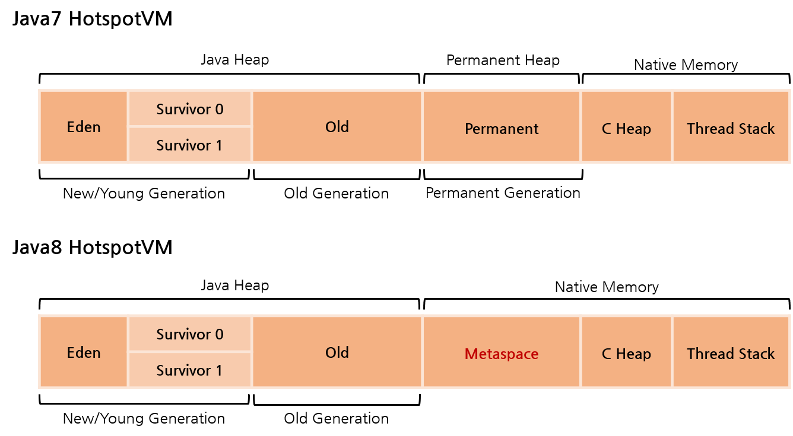
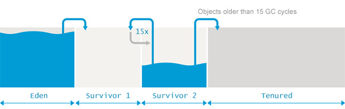
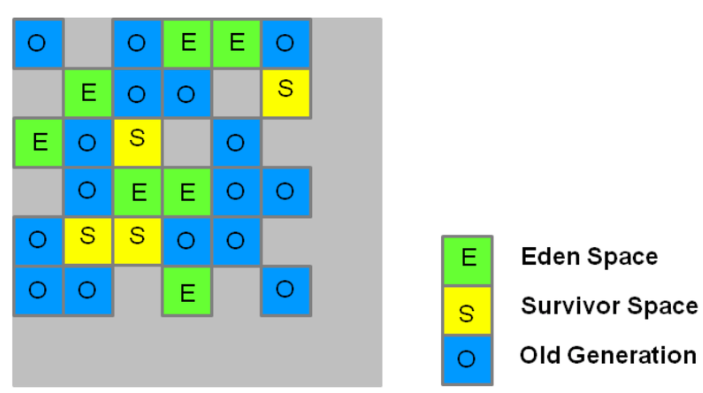

# 가비지컬렉션 (Garbage Collection)

> Heap 메모리를 재활용하기 위해 참조되지 않는 Object들을 해제해 가용 공간을 만드는 작업
>
> 즉,  메모리가 부족할 때 **가비지를 정리해주는 프로그램**
>
> **메모리 해제하는 작업**: Garbage Collection 
>
> **JAVA에서의 해제 작업 담당:** Garbage Collector

- JVM의 GC는 가비지를 다른 용도로 사용할 수 있게 **메모리 해제**시킨다.

- **언제 실행?**

  JVM은 메모리를 부여받고 열심히 프로그램들을 실행하다가 메모리가 부족해지는 순간이 오면 OS에게 추가로 메모리를 요청한다. 이때 **메모리를 더 달라고 여청할 때 GC가 실행**된다.

- 서버 프로그램의 경우 24시간 돌아가는데, 이때 JVM이 한가할 때(idle time) GC가 실행되고, JVM이 종료되면 당연히 사용하던 모든 메모리는 OS에 반환된다.

*~~분량이 많다~~*

</br>

## 가비지 (Garbage)

> '정리되지 않은 메모리', '유효하지 않은 메모리주소', ~~*일명 쓰레기*~~
>
> PL에서는 **Danling Object**, 자바에서는 **Garbage**라고 부름

```java
String[] array = new String[2];

array[0] = '0';
array[1] = '1';

array = new String[]{'G', 'C'};
```

</br>

- 위 코드에서 `array = new String[] {'G', 'C'}`전에 할당된 0, 1 은 **주소를 잃어버려서 사용할 수 없는 메모리**가 됨

  *앞으로 사용하지 않는 메모리를 가지고 있는 객체 역시 Garbage에 포함된다*

- C++을 포함한 다른 언어는 사용하지 않을 객체의 메모리를 직접 해제해주지만, **JAVA는 GC가 잡아줘서 개발자 입장에서 편리**
- 다만 모든 메모리 누수를 잡아주는 것은 아이여서 메모리 누수와 관련된 경계를 늦추면 안됨

</br>

## stop-the-world

> GC 실행을 위해 JVM이 애플리케이션 실행을 멈추는 것 (**suspend 상태**)

- GC가 실행될 때는, GC를 실행하는 스레드를 제외한 모든 스레드는 작업을 멈추고, GC작업이 끝나면 중단했던 작업을 다시 시작한다.
- **대개 GC튜닝이란 이 stop-the-world 시간을 줄이는 것을 의미**

</br>

## Mark and Sweep과  Reachability

### Mark and Sweep

> GC과정의 기본 알고리즘이라고 보면 될 것 같다.

- **Mark**: GC가 스택의 모든 변수 혹은 Reachable 객체를 스캔하면서 **각각 어떤 객체를 참조하고 있는지 찾는 과정**으로 이과정에서 stop-the-world가 발생한다.
- **Sweep**: Mark되어있지 않은 객체들을 **힙에서 제거하는 과정**

</br> 

### Reachability 란?

>  JAVA에서 GC가 가비지 객체를 판별하기 위해 사용하는 개념

어떤 객체에 유효한 참조가 있으면 ***reachable***, 없으면 ***unreachable***로 구별하고 *unreachable*은 가비지로 간주해서 GC 수행한다. 한 객체는 여러 다른 객체를 참조하고, 참조된 다른 객체들도 마찬가지로 또다른 객체들을 참조할 수 있으므로 객체들은 **참조 사슬**을 이룬다. 이러한 상황에서 유효한 참조 여부를 파악하려면 항상 유효한 최초의 참조가 있어야 하는데 이른 객체 참조의 **root set**이라고 한다.

<p align="center">
    
</p>

위 그림은 Runtime Data Area의 Thread, Heap, Method Area를 그린 그림이고, 객체에 대한 참조는 화살표로 표시되어있다. Heap에 있는 객체들의 참조는 다음 4가지 종류 중 하나이다. 

```markdown
1. 힙 내의 다른 객체에 의한 참조
2. Java 스택, 즉 Java 메서드 실행 시에 사용하는 지역변수와 파라미터들에 의한 참조
3. 네이티브 스택(JNI)에 의해 생성된 객체에 의한 참조
4. 메서드 영역의 정적 변수에 의한 참조
```

이중 2, 3, 4가 **root set**으로, **reachability를 판가름하는 기준**이 된다.

<p align="center">
    
</p>

위 그림은 root set과 heap내의 객체를 중심으로 그린 예시 그림이다. root set으로부터 시작한 참조사슬에 속한 객체들은 ***reachable***객체이고, 이 참조사슬과 무관한 객체들이 ***unreachable***객체로 GC의 대상이다.

</br>

## 세부적인 GC과정

Java에서는 개발자가 프로그램 코드로 메모리를 명시적으로 해제하지 않기 때문에 가비지 컬렉터(Garbage Collector)가 더 이상 필요 없는 (쓰레기) 객체를 찾아 지우는 작업을 한다. 이 가비지 컬렉터는 두 가지 가설 하에 만들어졌다(사실 가설이라기보다는 가정 또는 전제 조건이라 표현하는 것이 맞다).

> 1. 대부분의 객체는 금방 접근 불가능 상태(unreachable)가 된다.
>
> 2. 오래된 객체에서 젊은 객체로의 참조는 아주 적게 존재한다.

이러한 가설의 장점을 최대한 살리기 위해 HotSpot VM에서는 크게 2개의 물리적 공간인 Young영역과 Old영역으로 나누었다. 

</br>

<p align="center">
    
</p>

>  *java7기준으로 Heap 영역은 5개 영역 (eden, survivor1, survivor2, old, permanent)*
>
> *Java8기준으로 Heap 영역은 4개의 영역 (eden, survivor1, survivor2, old)로 나뉜다.*

GC는 크게 **Minor GC, Major GC, Full GC**가 있음.

</br>

### Minor GC: New/Young 영역에서 일어나는 GC

> JVM에 새로운 객체가 위치할 공간이 충분하지 않으면, 공간을 확보하기 위해 GC 실행

<p align="center">
    
</p>

1. 새로 생성한 대부분의 객체는 *Eden*영역에 위치한다. 이때 *Eden*영역에 객체가 가득차면 GC가 발생한다.

2. *unreachable*객체들은 *Eden*영역이 클리어 될 때 메모리에서 해제되며, *reachable*객체들은 *Survivor*영역 중 하나로 이동된다. **이때 두 *Survivor*공간 중 하나는 항상 비어있어야 한다.** 

3. *Eden*영역에서 객체가 가득 찰 때 마다, *Eden*영역과 사용중인 *Survivor*영역을 대상으로 GC가 발생한다. 그리고 두 영역의 *reachable*객체들은 빈 *Survivor*영역으로 이동되고, 다른 영역의 객체를 클리어한다.

4. 3번 과정을 반복하다가 계속해서 살아남아 있는 객체는 ***Old(Tenured)*영역으로 이동**하게 된다. 

   (*기본적으로 15번의 GC Cycle을 기준으로 한다고 한다*)

</br>

> 이 방식의 성능상 이점
>
> 1. *Young Gen*은 *Old Gen*보다 사이즈가 작고, GC가 전체 영역을 처리하는 것보다 덜 걸린다. **즉, stop-the-world로 애플리케이션이 중지되는 시간이 짧아진다.**
> 2. *Young Gen*을 한번에 모두 비우기 때문에 이 영역에 연속적인 여유 공간이 만들어져 **메모리 파편화를 방지 할 수 있다.**

</br>

### Major GC: Old 영역을 청소

> *Old Gen*의 공간은 상당히 크며 **가비지가 될 가능성이 낮은 객체가 저장**된다. 따라서 *Young Gen*에 비해 GC가 덜 자주 발생하며, **시간이 오래 소요된다**. 기본적으로 데이터가 가득 차면 GC를 실행되며, 대부분의 객체는 *reachable*하다고 예상하여 Mark와 Copy가 발생하지 않는다. 

- *Old Gen*의 GC는 *Young Gen*의 GC에 비해 상대적으로 시간이 오래 소요되기 때문에 ***Old Gen으로 이동하는 객체의 수를 줄이면 Full GC가 발생하는 빈도를 많이 줄일 수 있다.*** 이말은 객체를 마음대로 *Young Gen*에 남긴다는 의미가 아니라, *Young Gen*의 크기를 잘 조절하면 큰 효과를 볼 수 있다는 뜻이다. 

- GC 방식에 따라서 처리 절차가 달라지며, JDK 7 기준으로 하단의 5가지 방식이 존재

  1. **Serial GC**

     > Java 5, 6에서 사용되었던 방식으로, 운영서버에서 절대 사용하면 안되는 방식이다. 데스크톱의 CPU코어가 하나만 있을 때 사용하기 위해 만든 방식으로 Serial GC를 사용하면 성능이 많이 떨어진다.

     ***Mark-Sweep-Compaction*** 알고리즘을 사용하는 GC방식으로, 앞서 설명한 ***Mark and Sweep***과정을 거친 뒤 마지막 단계에서는 각 객체들이 연속되게 쌓이도록 힙의 가장 앞 부분부터 채워서 객체가 존재하는 부분과 객체가 없는 부분으로 나눈다(*Compaction*).

     </br>

  2. **Parallel GC**

     > Serial GC와 기본알고리즘은 동일하지만, Serial GC는 GC를 처리하는 스레드가 하나 인 것에 비해 Parallel GC는 **GC를 처리하는 스레드가 여러개**이다. Parallel GC는 메모리가 충분하고 코어의 개수가 많을 때 유리하다.

     </br>

  3. **Parallel Old GC**

     > 앞서 설명한 Parallel GC와 비교하여 *Old Gen*의 GC알고리즘만 다르다. 

     ***Mark-Summary-Compaction***단계를 거친다. *Summary*단계는 앞서 GC를 수행한 영역에 대해 별도로 살아있는 식별한다는 점에서 *Sweep*단계와 다르며 좀 더 복잡한 단계를 거친다.

     </br>

  4. **Concurrent Mark & Sweep(CMS) GC**

     > 애플리케이션 스레드와 가비지컬렉션 스레드가 동시에 실행되어 ***stop-the-world*시간을 최소화 하는 방식**으로, 애플리케이션의 latency를 향상시키는 것이 주안점

     Parallel GC와 가장큰 차이점은 *Compaction*작업 여부로, 작업하지 않는다. 때문에 속도가 빠르지만, 메모리 단편화로 인해 concurrent mode failure가 발생할 수 있고, 이 경우에 *Compaction*작업을 수행한다.

  5. **G1 GC**

     > 앞서 설명한 어떤 GC방식보다 빠르며, heap 영역이 매우 큰 머신(*최소 4GB*)돌리기 적합하다. CMS GC의 단점을 보완한 방법으로 JDK 7부터 정식으로 포함하여 제공하는 기능

     Heap영역을 여러개의 Region으로 나누고, 각 Region에서 *Young Gen*, *Old Gen*을 유동적으로 사용한다.

     <p align="center">
         
     </p>

</br>

### Full GC: Young & Old 영역 모두에서 Heap 전체를 청소

> 실행시간이 상대적으로 Minor GC에비해 길기때문에, 실행에 시간이 오래 소요되면 (1초이상) 연계된 여러 부분에서 타임아웃이 발생할 수 있다. 그렇다고 FULL GC실행시간을 줄이기 위해 *Old Gen*의 크기를 줄이면 자칫 *OutOfMemoryError*가 발생하거나 Full GC의 횟수가 늘어난다. 반대로 크기를 늘리면 Full GC횟수는 줄어들지만 실행시간이 늘어난다. 때문에 **Old 영역의 크기를 적절하게 잘 설정하는 것이 중요하다.** **GC 튜닝에 대한 자세한 내용은** https://d2.naver.com/helloworld/37111를 참고

</br>

## cf. JVM 실행시 Heap 메모리 최대 크기는 왜 변경이 불가능할까?

> Heap 메모리 최대 크기는 실행시 Option으로 설정하고, 실행할 때 변경이 불가능하다. 즉 Option으로 설정한 최소, 최대 Heap 사이즈에서 동적으로 크기가 변경되고, 실행 시 메모리를 더 사용하기 위해 최대메모리를 늘릴 수 없다. 이유가 뭘까?

- **GC의 성능문제**

- **JVM이 메모리를 할당하다가 다른 프로세스에 영향을 주는 경우를 방지** 

  > OS는 메모리가 너무 부족해지면 프로세스를 죽이는 액션을 하기 때문에 이러한 경우를 방지함

- **OS에 메모리 파편화가 발생하는 경우, 관리의 문제가 생김**

  > JVM도 프로세스이기 때문에 프로세스를 동적으로 메모리를 할당할 경우 OS에서 연속되지 않은 메모리 공간을 프로세스에게 제공하고 이로인해 메모리 파편화가 발생할 수 있음

</br></br>

참고 및 출처: 

https://plumbr.io/handbook/garbage-collection-in-java#eden

https://d2.naver.com/helloworld/1329

https://d2.naver.com/helloworld/329631

http://blog.naver.com/PostView.nhn?blogId=kbh3983&logNo=220989675046

https://code-factory.tistory.com/48
