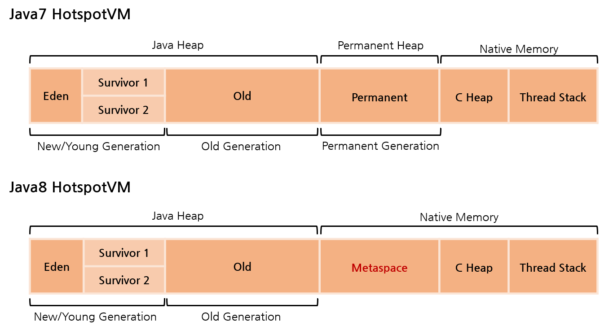

# JVM (Java Virtual Machine)

> Java Byte Code를 실행할 수 있는 주체로, OS에 맞게 해석해주는 역할을 한다

### JVM 이 중요한 이유?

메모리를 효율적으로 사용하여 성능을 높이기 위해서는 JVM의 메모리 구조를 반드시 알아야한다.
 

### JVM의 주요 기능

1. Byte Code는 JVM 위에서 OS 종류 상관없이 실행

2. 프로그램 메모리를 관리하고 최적화 (*Garbage Collection*)

 

## Java 프로그램의 실행 과정

1. 프로그램이 실행되면 JVM은 OS로 부터 프로그램이 필요로 하는 메모리를 할당 받는다

   > JVM은 이 메모리를 용도에 따라 여러 영역으로 나누어 관리

2.  java 컴파일러(`javac`)가 java 소스코드(`.java`)를 읽어들여 **java 바이트 코드(`.class`)로 변환**시킨다.

3. Class loader를 통해 **바이트 코드들이 JVM으로 로딩**된다.

   > 이때 JVM은 OS가 바이트코드를 이해할 수 있도록 해석해줌

4. 로딩된 **바이트 코드들**이 Execution engine을 통해 **해석**된다.

5. 해석된 바이트코드는 **Runtime Data Areas에 배치**되어 실질적인 수행이 이루어진다.

   > 이때 JVM은 필요에 따라 스레드 동기화, GC 등의 관리작업을 수행

   
</
 

## JVM 구조

- **Class Loader**

  > **Runtime 시점**에 java 바이트코드(`.class`)를 로딩하게 해주며, 
  > 클래스 인스턴스를 생성하면 클래스 로더를 통해 **메모리에 로드**

- **Runtime Data Areas** `★ Java 메모리 영역` 

  > JVM이 프로그램을 수행하기 위해 **OS로 부터 별도로 할당 받은 메모리 공간**으로, 5가지 영역으로 나눠짐
  > 자세한 설명은 하단의 *Java Memory Management* 섹션 참고

- **Execution Engine**

  > Runtime Data Areas에 배치된 바이트코드를 실행하는 런타임 모듈로, 
  > 바이트 코드를 명령어 단위로 읽어 실행

  처음 나왔을 때는 `Interpreter 방식` 이였기 때문에 속도가 느렸지만,  **일정 기준이 넘어가면 `JIT complier 방식` 으로 실행**하며 속도가 보완되었다. 

  > **JIT (Just - In - Time) complier**
  >
  > 인터프리터 방식으로 실행하다가 적절한 시점에 바이트코드 전체를 컴파일하여 *네이티브 코드*로 변경하고, 이후에는 인터프리팅하지 않고 네이티브 코드로 직접 실행하는 방식

 

## Java Memory Management

   

### JVM Stack

> 프로그램 실행과정에서 임시로 할당되었다가 메소드를 빠져나가면 바로 소멸되는 특성을 지닌 데이터를 저장하는 영역

- {}나 메소드가 호출될 때 마다 각각의 스택 프레임(그 메서드만을 위한 공간)이 생성
- 호출된 메소드의 매개변수, 지역변수, 리턴 값 및 연산 시 일어나는 값들을 임시로 저장
 

### Native Method Stack

> 기계어로 작성된 프로그램을 실행시키는 영역

- JAVA가 아닌 다른 언어로 작성된 코드를 위한 공간으로, JAVA Native Interface를 통해 바이트코드로 전환하여 저장
- 이부분을 통해 C code를 실행시켜 Kernel에 접근 가능
 

### PC register ###

> 현재 수행중인 JVM명령의 주소를 가짐 (CPU의 PC와 같음)

- Thread가 시작될 때 생성되며, 생성될 때 마다 생성되는 공간으로 스레드마다 하나씩 존재한다.
 

### Method 영역 (= Class area, Static area)

> 클래스 정보를 처음 메모리 공간에 올릴 때, **초기화되는 대상을 저장하기 위한 메모리 공간**

- 올라가게 되는 메소드의 Byte Code는 프로그램의 흐름을 구성하는 Byte Code
- *Runtime constant Pool*이라는 관리 영역도 함께 존재하며, 상수자료형을 저장하여 참조하고 중복을 막는 역할을 수행한다.

  **올라가는 정보의 종류**

  1. Field 정보

     > 멤버변수의 이름, 데이터 타입, 접근 제어자에 대한 정보

  2. Method 정보

     > 메소드의 이름, 리턴타입, 매개변수, 접근제어자에 대한 정보

  3. Type 정보

     > class인지 interface인지의 여부 저장, Type 속성, 전체 이름, super class의 전체 이름

      

### ★Heap 영역

> **프로그램 상에서 데이터를 저장하기 위해** 런타임시 동적으로 할당하여 사용하는 가상 메모리 영역
>
> Method area에 로드된 클래스만 생성이 가능하고, **GC를 통해 메모리를 반환**

- new연산자로 생성된 객체 또는 인스턴스와 배열 저장
- JVM이 관리

    

[**~JAVA7** 기준] Heap 영역: New/Young, Old, Permanent Generation

[**JAVA8~** 기준] Heap 영역: New/Young, Old Generation

> *부가 설명*
>
> - JDK 8부터 Permanent Heap 영역이 제거되고, 대신 Metaspace가 Native Memory에 추가됨
>- Perm은 JVM에 의해 크기가 강제되던 영역
> - Metaspace는 Native memory 영역으로 **OS가 자동으로 크기를 조절**하며, 옵션으로 Metaspace의 크기를 줄일 수도 있다.
>- 그 결과 기존과 비교해 큰 메모리 영역을 사용할 수 있게 되었다.
> - JEP 122에서는 JRockit과 Hotspot을 통일시키기 위해 PermGen 영역을 삭제한다고 한다.

 

  1. **New/Young Generation**

     **Eden**: 객체들이 최초로 생성되는 공간

     **Survivor 1/2**: Eden에서 참조되는 객체들이 저장되는 공간

 

  2. **Old(Tenured) Generation**

     Young Generation에서 일정시간 이상 참조되고 있고 살아있는 객체들이 저장되는 공간

 

  3. **[~JAVA7] Permanent Generation**

     생성된 객체들의 정보들이 저장되는 공간으로, **메타데이터 저장 영역**이라고도 한다.

     (*클래스의 Meta정보/메소드의 Meta정보, Static 변수와 상수 정보*)

 

-----------------

*Method Area: **클래스 데이터**를 위한 공간*

*Heap Area: **객체**를 위한 공간*

 

 

참고: https://asfirstalways.tistory.com/158

[https://medium.com/@lazysoul/jvm-%EC%9D%B4%EB%9E%80-c142b01571f2](https://medium.com/@lazysoul/jvm-이란-c142b01571f2)

https://www.geeksforgeeks.org/java-memory-management/

https://johngrib.github.io/wiki/java8-why-permgen-removed/

