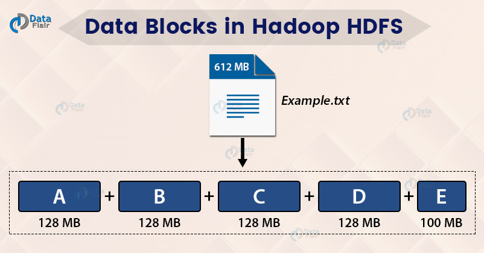
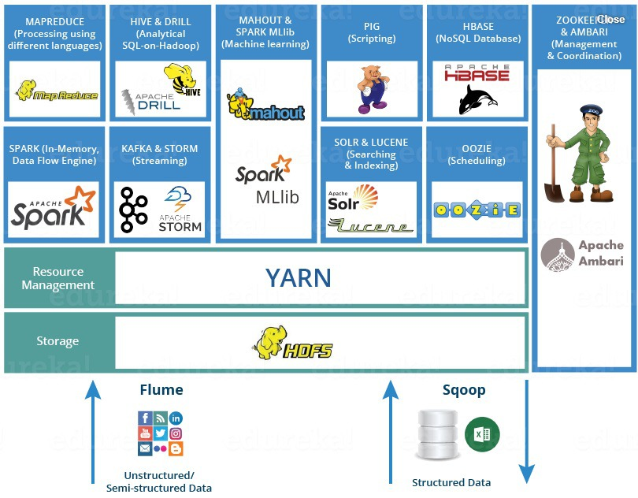
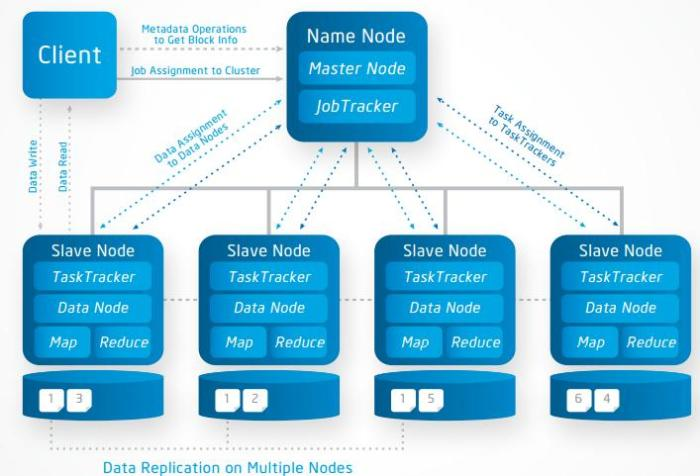
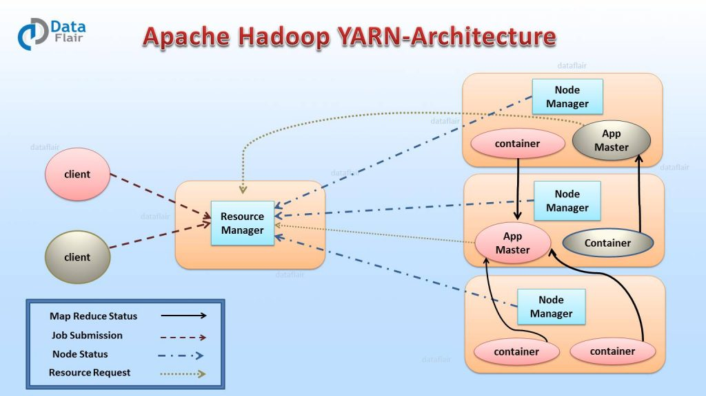
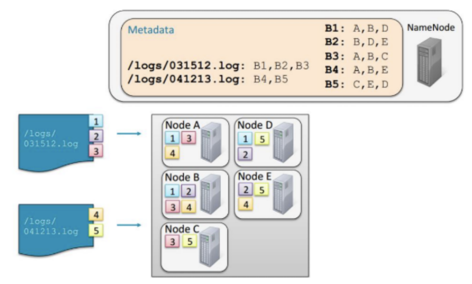
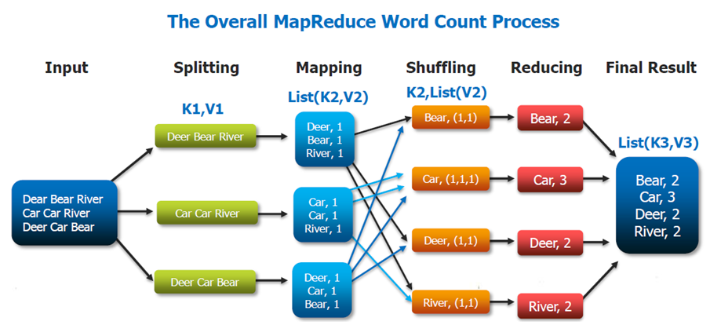

# Apache Hadoop

>  하둡은 분산 파일 시스템인 **HDFS(Hadoop Distributed File System)**에 데이터를 저장하고, 분산처리 시스템인 **맵 리듀스(MapReduce)**를 이용하여 데이터를 처리한다.
>
>  Hadoop은 현재 v1, v2, v3까지 나왔다

## Hadoop의 특징

### Distributed (데이터를 분산하여 저장)

수십만대 컴퓨터에 자 분산 저장 및 처리 => 데이터를 **block**단위로 나누어 저장

하나의 큰 file을 아래와 같이 블록단위로 나누어서 저장 (일반적으로 64M~128M)

    
	 출처: https://data-flair.training/blogs/data-block/ 

> **블록을 보통 크게 만드는 이유?**
>
> 1. 디스크 seek time 감소
> 2. 네임 노드가 관리하는 metadata의 개수 감소
>
> **metadata의 개수가 적으면 뭐가 좋을까?**
>
> 클라이언트와 네임노드의 통신 감소

### Scalability

Node를 추가하면 capacity가 Linear하게 비례하여 증가

### Fault-tolrance

Node가 fail한 경우, master node가 **failure을 감지하고 다른 node로 작업할당**

특정 Node의 성능이 매우 낮으면, fail된 노드 재시작 - 자동적으로 시스템에 연결되어 새로운 task 할당

### 오픈소스 & 큰 생태계 (Hadoop Ecosystem)

    

 

지금부터 하둡을 버전별로 알아보자

## Hadoop v1

> Hadoop v1에서는 맵리듀스는 Job Tracker와 Task Tracker가 담당하고, 분산저장(HDFS)는 네임노드와 데이터노드가 담당하도록 구조를 설계했다. **배치 처리에 특화된 시스템 구조**이다

|구분|HDFS|MapReduce|
|:-----:|:-----:|:-----:|
|Master|Name Node|Job Tracker|
|Slave|Data Node|Task Tracker|

**Master Node**: Slave node 정보 저장(Name Node) 및 실행할 Task 관리(Job Tracker) 역할

**Slave Node**: 데이터를 분산하여 가지고 있으며 *Client에서 요청이 오면* 데이터를 전달(Data Node)하는 역할 및 담당 Task를 수행(Task Node)하는 역할

**Client**: Name Node를 통해 정보를 받고 이후 직접적으로 Data Node와 통신

    
    출처: https://mapreducer.wordpress.com/2015/04/14/hadoop-architecture/

### HDFS: 클러스터에 Data 저장

> Data는 block단위로 클러스터의 여러 노드에 분산하여 저장되고, 각 block은 여러개의 **duplication(기본 3개)**을 생성해 서로 다른 노드에 저장

**[Master 노드] Name Node**

- HDFS 파일/디렉토리에 대한 meta data 유지
- 클라이언트로부터 데이터 위치 요청이 들어오면 전달
- 장비 손상시 Secondary Node로 대체

**[Slave 노드] Data Node**

- 데이터를 HDFS의 Block 단위로 저장
- Fault Recovery를 위해 duplication을 유지
- Heartbeat를 통해 지속적으로 파일 위치 전달

### MapReduce: 클러스터의 Data를 처리하기 위한 시스템

> Map과 Reduce 사이에는 *Shuffle*과 *Sort* 스테이지가 존재하며, 각 Map task는 전체 데이터 셋에 대해 별개의 부분에 대한 작업 수행

**[Master 노드] Job Tracker**

- 여러 Job을 수행하면서 성공적으로 끝날 때 까지 관리를 해주고, 스케쥴링과 모니터링을 담당한다
- 클러스터의 자원 관리

**[Slave 노드] Task Tracker**

- Task는 *Map Task* 와 *Reduce Task* 로 나누어짐
- Task가 위치한 HDFS의 데이터를 사용하여 MapReduce 수행

 

병렬처리의 작업(Task) 단위는 *슬롯 (Slot)*이다. 맵 슬롯, 리듀스 슬롯의 개수가 정해져있고, **실행시점에 역할이 정해지면 슬롯의 용도를 변경할 수 없기 때문에** 맵 작업 진행중일 때 리듀스 슬롯은 대기상태로 있었다. 때문에 클러스터가 100% 활용되지 않을 때도 있었다.

> 이러한 Hadoop v1은 병렬처리의 **클러스터 자원관리, 애플리케이션 라이프사이클 관리를 Job Tracker가 모두 담당**하여 병목현상이 발생했다. 이러한 병목현상을 개선하기 위해 Hadoop v2에서 YARN 아키텍처를 도입했다.

 

## Hadoop v2

> Job Tracker의 병목현상을 개선하기 위해 **YARN 아키텍처를 도입**했다. 이를 통해 배치/인터렉티브/스트림과 같이 다양한 데이터 처리가 가능해졌다.
>
> YARN은 기존의 Job Tracker의 기능을 분리하여 클러스터의 자원관리는 **리소스 매니저**가, 애플리케이션 라이프 사이클 관리는 **애플리케이션 마스터**가,  AM 실행 컨테이너 관리는 **노드매니저**가, 작업의 처리는 **컨테이너**가 담당하도록 하였다.

### YARN 아키텍처

    
    출처: https://data-flair.training/blogs/hadoop-yarn-tutorial/

#### **리소스 매니저 (Resource Manager, RM)**

리소스 매니저는 **클러스터에 1개 존재**하며, 클러스터의 자원 관리와 **Task 스케줄링**이 메인 역할이다. 

> Client가 애플리케이션 실행 요청을 하면 RM이 애플리케이션 마스터를 실행하고, 노드 매니저와 통신하여 자원 상황을 알아내고, 애플리케이션 마스터와 통신하여 필요한 자원이 무엇인지 알아내어 관리한다.

#### **노드 매니저 (Node Manager, NM)**

**노드당 1개씩 존재**하며, Yarn의 Slave daemon이다.  **컨테이너의 자원을 모니터링**하고 리소스 매니저에게 자원 상황을 보고하는 역할을 한다. 리소스 매니저의 지시를 받아 작업 요구에 따라 컨테이너를 생성한다.

#### **애플리케이션 마스터 (Application Master, AM)**

 **애플리케이션 당 1개씩 생성**되며, RM 스케줄러로 부터 적절한 컨테이너를 할당 받고,  **애플리케이션의 실행 상태를 모니터링**, 관리하는 것이 주 역할이다.

#### **컨테이너 (Container)**

CPU, Disk, Memory 등의 자원으로 정의된다. 모든 작업은 결국 여러개의 Task로 세분화되고, **각 Task는 각각의 Container에서 실행**된다. 커맨드 라인에서 실행할 수 있는 모든 프로그램은 Container안에서 모두 실행될 수 있고, **MapReduce의 경우, Mapper와 Reducer가 컨테이너에 할당되어 실행**된다.

 

### YARN 실행과정

1. YARN 클라이언트(YARN API를 사용)가 리소스 매니저에게 Job 실행을 요청한다. 정확히는 Job을 실행할 애플리케이션 마스터 코드를 리소스 매니저에게 넘긴다.

2. 리소스 매니저는 노드 매니저를 하나 랜덤하게 골라, 그 노드위에서 애플리케이션 매니저를 실행한다. 정확히는 그 노드 매니저가 존재하는 서버상의 컨테이너 하나가 실행되어 그 안에서 애플리케이션 마스터가 실행된다.

3. 애플리케이션 매니저(`리소스 매니저의 컴포넌트`)는 리소스 매니저에게 Job 실행에 필요한 컨테이너들의 할당을 요청한다. 즉 모든 리소스 요청은 리소스 매니저를 통해야하고, 나중에 애플리케이션 매니저들은 사용한 컨테이너들을 리소스 매니저에게 되돌려 주어야한다.

4. 리소스 매니저는 애플리케이션 매니저를 대신하여 노드매니저들에게 태스크 실행을 명령한다. 각 태스크는 각기 하나의 컨테이너안에서 실행된다.

 

## HDFS (Hadoop Distributed File System)

> 기존 파일 시스템의 상위에서 동작한다.

### HDFS 특징

- 대용량 데이터 저장
- 데이터 무결성 (한번 저장된 데이터는 **수정할 수 없고**, 파일 이동/삭제/복사/읽기만 가능)
- 장애를 빠른시간에 감지하고 대처
- 스트리밍 방식의 데이터 접근하여 **순차적으로** 쭉 읽는 방식

### HDFS의 파일 저장 방식

1. File은 **Block**단위로 분할
2. 데이터가 로드될 때 머신에 분산되어 저장
3. Block들은 여러 머신에 복제되어 Data Node(=Slave)에 저장
4. Name Node(=Master)는 어떤 Block들이 file을 구성하고 있고, 어느 위치에 저장되어 있는지에 대한 정보를 **meta data**로 관리

    

- Name Node의 metadata를 이용하지 않으면, HDFS에 접근할 수 있는 방법이 존재하지 않음

  

### 클라이언트 애플리케이션이 파일에 접근하는 경우

1. Name Node와 통신하여 파일을 구성하고 있는 Block들의 정보와 Data Node의 Block 위치 정보를 제공 받음
2. 이후 데이터를 읽기 위해 DataNode와 직접 통신

*HDFS의 Name Node daemon은 항상 반드시 실행되고 있어야 한다.*

### HDFS 접근 방법

1. Shell 커맨드 라인 사용: *hadoop fs* (-put: HDFS로 복사, -get: 로컬 Dir로 복사, -cat: 내용 출력 등)
2. Java API
3. Ecosystem 프로젝트 (ex. Sqoop (HDFS와 RDBMS 사이의 데이터 전송), Hue) 

 

## MapReduce (맵 리듀스)

> 맵 리듀스는 **데이터를 처리하기 위한 프로그래밍 모델**로, 대용량 데이터 처리를 분산 병령 컴퓨팅에서 처리하기 위한 목적으로 만들어졌다. 맵 리듀스도 어쨋거나 **Job이다**

    

### 맵리듀스의 단계

#### **Map 단계**

인풋 데이터를 가공하여 사용자가 원하는 정보를 <Key, Value> 쌍으로 변환한다. 먼저 *Splitting* 단계를 통해 입력한 파일을 분할한다. 하둡은 각 스플릿마다 한개의 Map Task를 생성하게 되고, 만들어진 Map Task는 Map함수를 통해 **<Key, Value> 구조를 가지는 중간 산출물을 생성**한다.

#### **Shuffle 단계**

메모리에 저장되어 있는 Map 함수를 통해 나온 <Key, Value>데이터를 파티셔닝하고 정렬하여 Disk에 저장하고, Reducer로 전달한다.

#### **Reduce 단계**

> 샌드위치로 비유하면 재료들을 재료 별로 모아놓는 것이 리듀스 단계

중간 산출물을 통해 Shuffling된 데이터를 하나로 합쳐 Reduce Task로 생성하고, Reduce 함수로 전달한다. 만들어진 결과물은 HDFS에 저장된다.

> 사실 이 맵리듀스를 실제 코드로 구현하는 것은 굉장히 복잡하다고 한다. 이러한 맵리듀스를 보다 유저 친화적으로 사용할 수 있는 방법이 제시가 되었는데, 그중 하나가 Spark이다.

 

출처 및 참고:

출처: [le temps est long.](https://nekopuzie.tistory.com/35 )

[https://brunch.co.kr/@devapril/6]()

