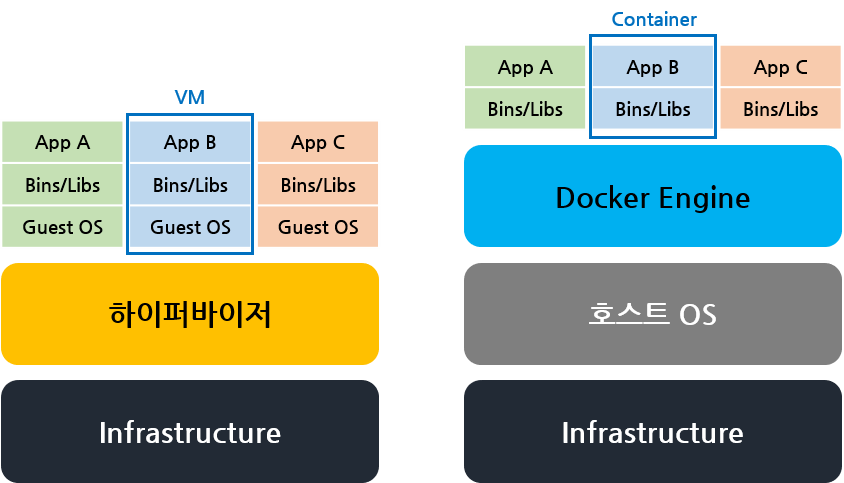
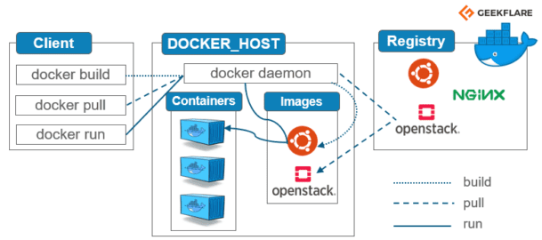

# 컨테이너(Container)와 도커 (Docker)

>  컨테이너에 대해서 알아보기 전에 [가상화](https://github.com/lja9702/CS_for_noob/blob/noob/Cloud/Concept%20of%20Cloud.md)를 보고 오자

### 컨테이너 이전의 가상화

일반적으로 쉽게 사용한 가상화기술로 ***가상머신(Virtual Machine)***이 있다. 

가상머신은 운영체제 인스턴스 하나를 구획화(Compartmentalizing)가 필요한 애플리케이션 각가에 할당하는 방식으로 '분리'를 제공한다. 따라서 거의 완전히 환경을 분리시킬 수 있는 방법이지만, 상당한 비용이 수반된다. 각 운영 인스턴스가 앱 자체에 **상당한 메모리와 CPU 파워를 소비**하고 있기 때문이다.

 

## 컨테이너 (Container)

> 애플리케이션과 애플리케이션을 구동하는 환경을 격리하는 공간을 뜻하며, 
>
> **호스트 OS의 커널을 공유하면서 격리된 컴퓨팅 자원을 제공하는 가상화 기술**

    

가상 머신(VM)은 하드웨어 스택을 가상화하지만, **컨테이너는 운영체제 수준에서 가상화를 실시하여 다수의 컨테이너를 호스트의 OS 커널에서 직접 구동한다.** 

 

### 컨테이너의 장점

1. **신속성이 높다**

   VM은 가상 하드웨어를 준비하고 그 위에서 Guest OS를 부팅해야하기 때문에 부팅시간이 느리다. 하지만 컨테이너는 프로세스를 띄우는 정도만 수행하면 되기 때문에 부팅시간이 빠르다. 이와 더불어 추가 배포시간도 짧다는 장점이 있다. 

2. **메모리 사용량이 적다**

   VM은 게스트 OS가 별도로 실행되어야 하기때문에 시스템 메모리가 차지하는 메모리가 크다. 하지만 컨테이너는 게스트 OS를 띄우지 않기 때문에 애플리케이션과 애플리케이션이 구동될 때 필요한 라이브러리와 환경 정도의 적은 메모리를 사용한다.

3. **효율성이 높다**

   많은 기업이 애플리케이션 서비스를 안정적으로 운영하기위해, 1개의 가상머신에 1개의 서비스를 구동하는 것을 권장한다. 하지만, 해당 애플리케이션이 가상머신의 모든 자원을 사용하는 것이 아니기 때문에 유휴자원이 생겨 성능적으로 오버헤드가 생길 수 있다. 반면 컨테이너는 운영체제의 자원을 공유하기 때문에 애플리케이션을 실행하는데 필요한 만큼의 자원만 할당받을 수 있다. 즉, **서버 전체 자원을 효율적으로 사용할 수 있다.**

이러한 장점 덕분에 **개발 환경을 이전**하거나 **마이크로 서비스화** 할 때 용이하다.

 

### 컨테이너의 단점

가상 머신의 경우 정확히 할당된 자원 내에서 운영되기 때문에, 컨테이너에 비해 안정적으로 운영될 수 있다. 반면 컨테이너들은 OS커널을 공유하기 때문에, **하나의 컨테이너가 무리하게 컴퓨팅 자원을 사용할 수 있다.** 자원 할당량을 사전에 지정시켜줄 수 있지만, 만약 이런 상황이 발생하면 컨테이너에 장애가 발생할 수 있다. ~~근데.. 이런 문제는 쿠버네티스로 해결할 수 있다고 한다~~

 

## 도커 (Docker)

컨테이너 기술은 통상 Docker로 통용되고, 많이 쓰이며, 산업표준이다. 이러한 도커를 이해하기 위해서는 **도커의 구성요소를 이해**해야 한다.

### 도커의 구성요소

**Docker Container + Docker Image + Docker Registry**

command line 클라이언트는 Docker daemon이라고 불리는 프로세스에 무엇을 할지 명령어를 알려준다. 이 daemon은 registry 또는 repository로 부터 이미지를 가져온다. 이러한 이미지들은 로컬 머신에 캐시되고 데몬에 의해 부팅되어 컨테이너를 실행한다.

 

### 도커 이미지 (Docker Image)

> 컨테이너 실행에 필요한 **파일시스템과 바이너리만 포함**하고 있는 것으로, Docker 컨테이너를 만들기위한 **Read Only Layer**이다.

- **서비스 운영에 필요한 서버 프로그램, 소스 코드, 컴파일된 실행 파일을 묶은 형태**
- 상태값을 가지지않고 변하지 않는다. (**immutable**)
- 저장소(Registry)에 올리고(push) 받는(pull) 것은 이미지이다
- 컨테이너는 **이미지를 실행한 상태**로, 이미지로 여러개의 컨테이너를 만들 수 있다
- OS로 치면 **이미지는 실행파일**이고 **컨테이너는 프로세스**
- 도커는 베이스 이미지에서 바뀐 부분만 이미지로 생성하기 때문에, 컨테이너로 실행할 때 베이스 이미지와 바뀐 부분을 합쳐서 실행한다.

 

### 도커 컨테이너 (Docker Container)

> 실행가능한 Docker 이미지

 

### 도커 저장소 (Docker Registry)

> 도커 이미지를 저장해놓는 원격 저장소로, 이미지를 가져오는 저장소이다. 기본적으로 Open hub이기 때문에,  private하게 사용하기 위해서는 비용을 내야한다.

Docker hub는 Git이랑 같기 때문에, 로컬에 image를 만들었다고 자동으로 hub에 올라가는 것이 아니다. 따라서 hub에 올리기 위해서는 push를 해주어야 한다.

 

### Linux Containers와 Docker

> Docker의 초기 모습은 Linux Containers (LXC)를 직접적으로 기반하여 만들어졌다. 

Docker는 **Linux 커널과 cgroups, 네임스페이스 기술을 기반**으로 하고있다.

LXC는 오늘날 컨테이너라고 불리는 가장 첫번째 구현이고, **cgroups**와 **namespaces**분리를 사용하여 별개의 프로세스와 네트워킹 스페이스를 가진 가상환경을 만들어냈다. 이 둘은 **컨테이너와 호스트에서 실행되는 다른 프로세스 사이에 벽을 만드는 리눅스 커널 기능**이다.

 

출처 및 참고:

[https://cloud.google.com/containers?hl=ko]()

[https://developer.ibm.com/kr/cloud/2019/02/01/easy_container_kubernetes/]()

[https://m.blog.naver.com/PostView.nhn?blogId=complusblog&logNo=220980996544&proxyReferer=https:%2F%2Fwww.google.com%2F]()

[http://www.itworld.co.kr/insight/110748]()

[https://goofcode.github.io/container-101]()

[https://www.slideshare.net/pyrasis/docker-fordummies-44424016]()

[https://www.congao.com.cn/?Tech-Blog/115.html]()
