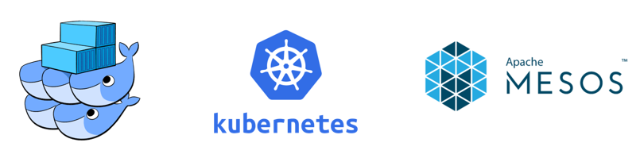
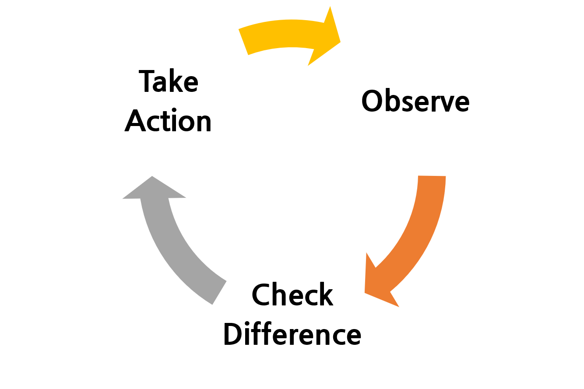
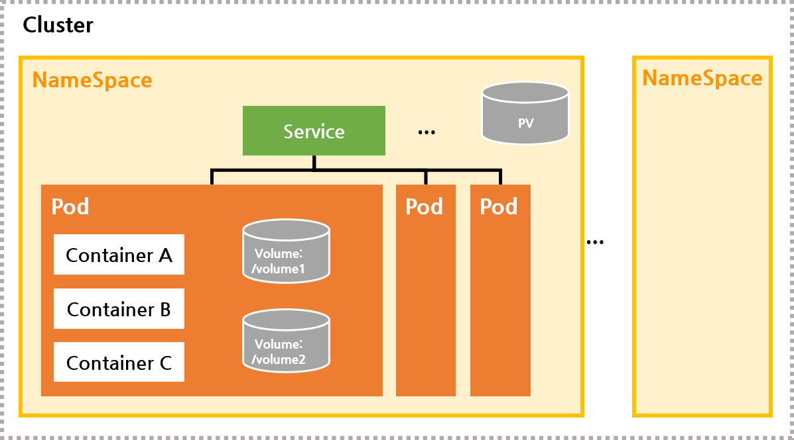
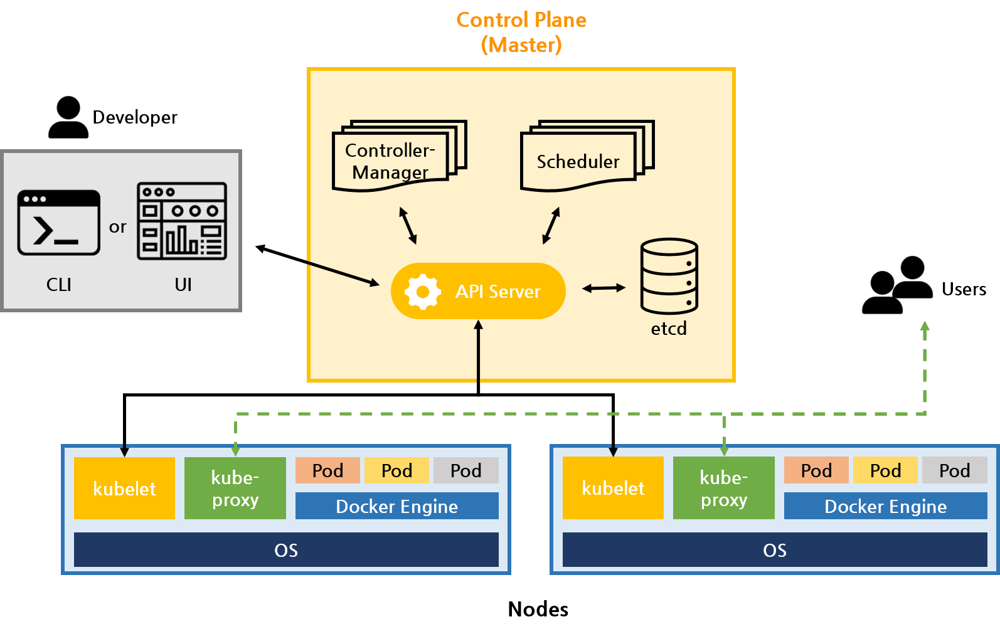
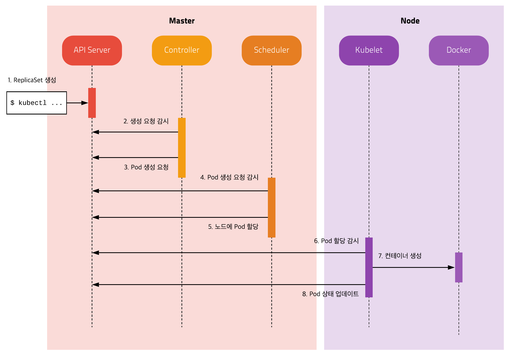

# 쿠버네티스 (Kubernetes) 

>  컨테이너 오케스트레이션 도구로, Google에서 개발한 오픈소스 프로젝트이다

도커 컨테이너 갯수가 늘어나면 필요한 자원도 지속적으로 늘어난다. 때문에 서버 또한 여러대로 늘어날 수 있는데, 이러한 많은 서버들과 컨테이너를 소수의 인원으로 관리하기에는 상당히 어렵다. 이 문제를 **효율적으로 관리하기 위해 등장**한 것이 **컨테이너 오케스트레이션 툴**이다.

## 컨테이너 오케스트레이션 (Container Orchestration)

> 컨테이너 오케스트레이션이란 **컨테이너를 쉽고 빠르게 배포/확장하고 관리를 자동화해주는 도구**이다.

<p align="center">
    
</p>

흔히 잘 알려진 오케스트레이션 툴은 *도커 스웜 (Docker Swarm)*, *쿠버네티스 (Kubernetes)*, *아파치 메소스 (Apach Mesos)* 정도이다.

### 오케스트레이션 툴의 기능

컨테이너 오케스트레이션 툴의 기능에는 **컨테이너 배포** 뿐 만 아니라 **서비스를 관리하고 유지보수 하기 위한 많은 기능**을 포함하고 있다. 툴마다 기능은 살짝 다르지만 주요기능은 다음과 같다.

- 노드 클러스터링
- 컨테이너 로드밸런싱
- 컨테이너의 배포와 복제 자동화
- 컨테이너 장애 복구 기능 (정상적으로 작동하고 있는지 체크하고 문제가 있으면 재기동)
- 컨테이너 오토스케일링
- 컨테이너 스케줄링 (컨테이너를 적절한 서버에 배포해주는 것)
- 로깅 및 모니터링

</br>

### 왜 쿠버네티스인가?

- 근 5년간 트랜드가 지속적으로 올라가 가장 높다.
- 주요 클라우드 벤더(Amazon, Google, Azure)와 On-premise 솔루션 업체(IBM, 시스코) 같은 업체에서 쿠버네티스를 지원하고 있다.
- [CNCF](https://landscape.cncf.io/) 애플리케이션 대부분이 쿠버네티스와 궁합이 잘 맞는다.

*이러한 장점이 있는데도 불구하고 쿠버네티스의 단점은 **복잡하고 초반에 개념을 이해하기 어렵다.** ~~진짜~~*

</br>

## 쿠버네티스 개념/용어

### Desired State 와 Control Loop

> 쿠버네티스는 **Desired State (원하는 상태)**를 유지하는 것이 핵심이다.

**원하는 상태**란, 관리자(Developer)가 원하는 환경을 의미하며, 구체적으로 몇개의 웹서버를 띄울지, 몇번 포트로 서비스할지 등을 말한다. 이 원하는 상태를 만들기 위해 사용하는 메커니즘이 **Control Loop (제어루프)**이다. 제어루프는 다음과 같이 동작한다.

<p align="center">
    
</p>

1. **Observe**: Object들이 원하는 상태가 무엇인지 확인 (*Object는 하단에서 설명*)
2. **Check Differences**: Object들의 현재 상태가 어떤지 체크하고 원하는 상태와 비교해 어떤 차이가 있는지 확인
3. **Take Action**: 현재 상태를 원하는 상태로 만들어줌

위 과정을 반복한다.

*쿠버네티스를 사용하려면 어떤 상태가 있고, 어떻게 상태를 선언해야 하는지 알아야한다.*

</br>

### Object

> 쿠버네티스를 이해하기 위해서 **가장 중요한 부분**이다. 오브젝트는 **상태를 관리하기 위한 대상**을  말한다. 오브젝트는 ***Basic Object***(기본 오브젝트)와 ***Controller***(컨트롤러)로 이루어진다.

**Basic Object** (기본 오브젝트)

- 컨테이너화가 되어 배포되는 애플리케이션의 워크로드를 기술하는 오브젝트

- 종류: ***Pod, Service, Volume, Namespace***

  > 하단에서 자세히 설명하겠지만 간단하게 *Pod*는 컨테이너화 된 애플리케이션, *Volume*은 디스크, *Service*는 로드밸런서, *Namespace*는 패키지명 정도로 생각하면 된다.

**Controller** (컨트롤러)

- 기본 오브젝트는 애플리케이션을 설정하고 배포하는 것이 가능한데, 이를 좀 더 편리하게 관리하기 위해서 컨트롤러라는 개념 사용
- 종류: ***Replication Controller, ReplicaSet, Deployment, DaemonSet, Job, StatefulSet*** 등

**+) Object Spec** (오브젝트 스펙)

- 오브젝트들은 모두 오브젝트의 특성(설정정보)를 기술한 오브젝트 스펙으로 정의
- yaml이나 json파일, 커멘드 라인을 통해서 스펙을 정의할 수 있음

</br>

### Basic Object

> Pod, Service, Volume, Namespace이 속한다

<p align="center">
    
</p>

**Pod**

- 쿠버네티스에서 `가장 기본적인 배포 단위`로, 컨테이너를 포함한 단위

-  쿠버네티스 특징: 컨테이너를 개별적으로 하나씩 배포하는 것이 아니라 **Pod라는 단위로 배포한다. (Pod는 1개 이상의 컨테이너로 구성)**

- Pod 내 컨테이너 간에는 IP와 Port를 공유한다. 

  즉, 2개의 컨테이너가 하나의 Pod로 배포되었을 때, localhost로 서로 통신가능

  ex) A: 8080, B: 7001 Port로 배포시 A에서 B를 localhost:7001로 호출 가능

- Pod 내 배포된 컨테이너간에는 **디스크 Volume 공유 가능** (다른 컨테이너의 파일을 읽어 올 수 있음)

- 하나의 Pod는 하나의 노드에만 배치될 수 있으며, Pod내 컨테이너가 각각 다른 노드에 배치 될 수 없다.

**Volume**

- 컨테이너 restart와 상관없이 파일을 영속적으로 저장해야하는 경우 사용(ex. DB) 

- 컨테이너의 외장 디스크

- Pod를 기동할 때 컨테이너에 마운트해서 사용

- Pod내 컨테이너 간 Volume 공유 가능

- **PersistentVolume**: 쿠버네티스에 지정한 물리 디스크

  **PersistentVolumeClaim**: PersistentVolume과 Pod를 연결할 수 있게 해주는 개념

**Service**

> Pod는 컨트롤러에 의해 관리되기 때문에 한군데에 고정되어 떠있지않고, 클러스터 내를 옮겨다닌다. 이 과정에서 노드를 옮기면서 실행되기도 하고, 클러스터내의 Pod IP가 변경되기도 한다. 이렇게 동적으로 변하는 **Pod들에 고정된 방법으로 접근하기 위해 사용하는 것이 Service**이다.

- Service를 사용하면 Pod가 클러스터 내에 어디에 있는지 상관없이 **고정된 주소를 이용해 접근이 가능**하다

- **label selector**: Service에 정의하는 것으로, 같은 label을 갖고있는 Pod로 묶어 서비스를 제공

- **label**:  각Pod를 생성할 때 메타데이터에 label 정의

- 같은 서비스에서 pod간 로드밸런싱을 진행

  > **로드 밸런싱 (Load Balancing)**
  >
  > 하나의 인터넷 서비스가 발생하는 트래픽이 많을 때, 여러대의 서버가 로드율 증가를 고려해 적절하게 분산처리하여 해결
  >
  > **Load 란?**
  >
  > CPU가 단위 시간 동안 얼마나 자주 바쁘게 작업하고있는지를 보여주는 지표로, 로드율이 높다는 것은 단위 시간 동안 컴퓨터가 바쁘게 움직이고 있다는 뜻(즉, 로드율을 낮추어야 부하가 감소)

- **서비스 타입**

  1. **ClusterIP**: 서비스에 내부(Cluster) IP를 할당한다. 따라서 클러스터 내에서는 접근 가능하지만, 클러스터 외부에서는 접근이 불가능하다.
  2. **NodePort**: 각 노드의 지정된 포트를 할당하는 방식으로, node1:8080, node2:8080 이런방식으로 노드에 상관없이 포트번화만 서비스에 지정된 것을 사용하여 접근한다. 따라서 클러스터 내부 뿐만 아니라 클러스터 외부에서도 접근가능하다.
  3. **LoadBalancer**: 클라우드 서비스에서만 보통 설정가능한 방식으로, 외부 IP를 가지고있는 로드밸런서를 할당한다. 따라서 외부 IP를 가지고 있기 때문에 외부에서 접근 가능하다
  4. **ExternalName**: 클러스터 내부에서 외부로 접근할 때 주로 사용하며, 외부로 접근할 때 사용하는 값이기 때문에 설정할 때 셀렉터가 필요없다. 예를들어 foo.com과 같이 설정하면, 클러스터 내의 Pod들이 이 서비스를 호출할 경우 foo.com으로 포워딩 된다 (일종의 프록시 역할).

**Namespace**

- 쿠버네티스 클러스터 내의 논리적인 분리단위
- 네임스페이스 별로 자원들을 나누어 관리할 수 있고, 접근권한, 리소스 할당량 등을 설정할 수 있다

</br>

### Controller

> Replication Controller, ReplicaSet, Deployment, DaemonSet, Job, StatefulSet 등이 속한다
>
> **Object가 Spec에 정의된 상태로 유지될 수 있도록 지속적으로 변화시키는 주체**이다

**ReplicaSet**

- 규모가 되는 애플리케이션을 구축하기 위해서는 여러개의 Pod를 실행해 가용성을 확보해야하는데, 이때 사용하는 것이 ReplicaSet이다

- **똑같은 정의를 갖는 Pod를 여러개 복제하여 관리하기 위한 리소스**

```yaml
...
spec:
    replicas: 3			# replicas: 관리될 Pod의 수 
    selector:			# selector: Pod들을 묶는 기준 (label)
        app:nginx
    template:			# template: Pod를 추가로 띄울 때, Pod정보 정의
    ...
        containers:
        - name: nginx
        image: nginx
        ports:
        - containerPort:80
```

**Deployment**

- ReplicaSet보다 상위에 있는 개념으로 **ReplicaSet 배포의 기본 단위가 되는 리소스**

  (실제 운영에서는 ReplicaSet을 바로 사용하는 것 보다, 좀 더 추상화된 Deployment를 사용)

- Pod 배포를 위해 ReplicaSet을 생성하고 관리하는 역할을 하며, 특히 롤백을 위한 기존 버전 RC 관리등 여러 기능을 포괄적으로 포함하고 있다.

</br>

*Replication Controller는 중요도가 떨어져 사라질 예정이라고 한다. 현재 이 역할을 ReplicaSet과 Deployment가 대신하고 있다고 한다*

</br>

## 쿠버네티스 아키텍쳐

> 쿠버네티스는 쉽게 중앙(**Master**)에 API Server와 상태 저장소를 두고 각 서버(**Node**)의 kubelet과 통신하는 구조이다. 자세한건 아래에서 살펴보자

<p align="center">
    
</p>

쿠버네티스는 크게 **마스터**와 **노드**로 이루어진 클러스터 구조로, 위의 그림과 같다

### 마스터 (Master, Control Plane)

> 마스터는 **클러스터 전체를 control하는 시스템**으로, 크게 API서버, 스케줄러, 컨트롤러 매니저, etcd로 구성되어 있다

**API Server** (kube-apiserver)

- **모든 요청을 처리하는 마스터의 핵심 모듈**로, 원하는 클러스터 워크로드 상태를 정의하고 조회할 수 있는 **RESTful 웹서비스를 제공**한다
- kubectl의 요청뿐만 아니라 내부 모듈의 요청도 처리하며 권한을 체크하여 요청을 거부할 수도 있음
- 원래 상태를 key-value 저장소인 etcd에 저장하고, 저장된 상태를 조회하는 작업을 함

**etcd** (분산 저장소)

- **key-value 저장소**
- 여러 개로 분산하여 복제할 수 있기 때문에 안정성이 높고 속도가 빠름
- 값을 저장하고 읽는 기능 뿐 만 아니라 watch 기능이 있어 상태 변화를 바로 체크하여 로직 실행

**Scheduler**(스케줄러)

- 할당되지 않는 Pod를 조건 (필요한 리소스, 라벨)에 따라 **적절한 노드 서버에 할당**

**Controller-Manager**(컨트롤러)

- kube-controller-manager(큐브 컨트롤러)와 cloud-controller-manager(클라우드 컨트롤러)로 나뉨

- 큐브 컨트롤러는 쿠버네티스에 있는 거의 모든 오브젝트의 상태를 관리한다

  > 오브젝트별로 분업화하여 ***Deployment***는 *ReplicaSet 생성*, ***ReplicaSet***은 *Pod 생성*, ***Pod***는 *스케줄러가 관리*

- 클라우드 컨트롤러는 AWS, GCE, Azure 등 클라우드에 특화된 모듈

</br>

### 노드 (Node)

**kubelet**

- 노드에 할당된 **Pod의 생명주기를 관리**
- Pod를 생성하고 Pod안의 컨테이너에 이상이 없는지 확인하여 주기적으로 **마스터에게 컨테이너 상태를 전달**

**kube-proxy**

- 각 노드에서 실행되는 네트워크 프록시로, 쿠버네티스의 Service 개념의 구현부이다
- **Pod로 연결되는 네트워크를 관리**
- 로드밸런싱을 제공하고, 단지 서비스에 도달하는데 사용
- UDP, TCP, SCTP를 이용하여 proxy하며 HTTP는 이해하지 못함

</br>

## Pod 가 생성되는 과정

<p align="center">
    
</p>

출처: https://subicura.com/2019/05/19/kubernetes-basic-1.html

</br>

출처 및 참고:

[https://team-platform.tistory.com/48]()

[https://bcho.tistory.com/1255]()

[https://subicura.com/2019/05/19/kubernetes-basic-1.html]()

[https://theithollow.com/2019/09/16/kubernetes-desired-state-and-control-loops/]()

[https://arisu1000.tistory.com/27838]()

[https://joont92.github.io/kubernetes/%EC%A3%BC%EC%9A%94-%EA%B0%9C%EB%85%90/](https://joont92.github.io/kubernetes/주요-개념/)


