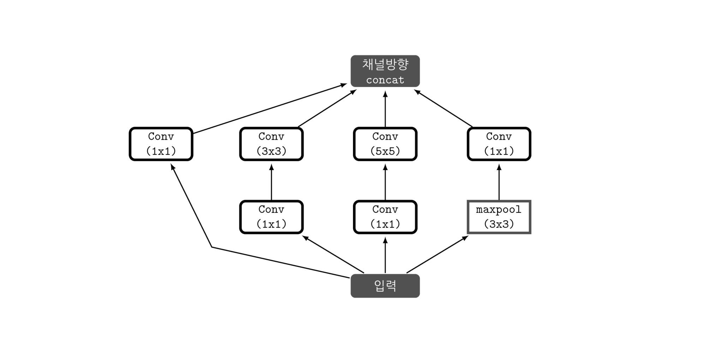
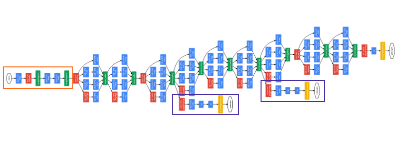
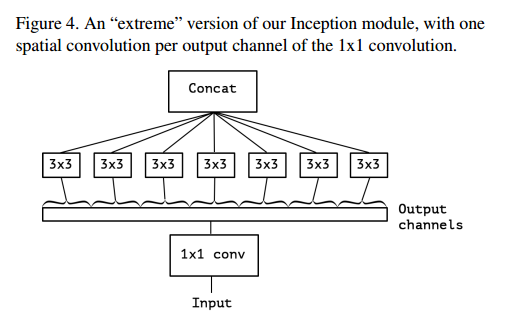
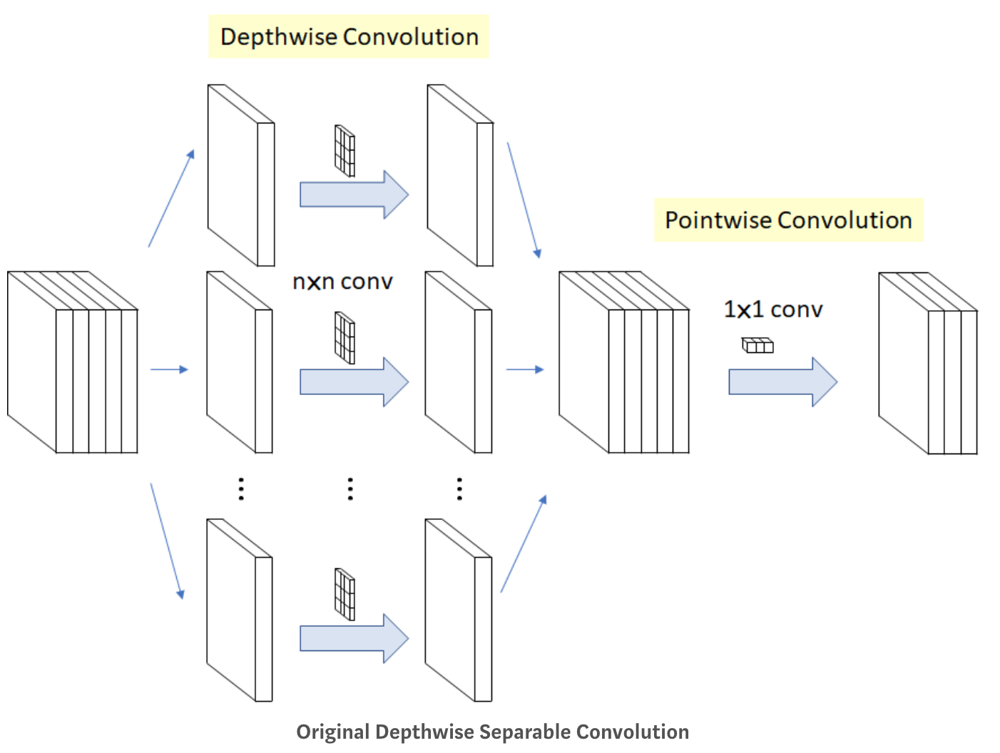

# Inception & Xception

> 오픈소스 컨트리뷰톤 Semantic Segmentation Zoo 프로젝트에서 했던 Xception 모델을 정리하고자 한다.

2016년 Google이 논문을 통해 발표한 CNN모델로, Inception에 기초를 두고 있다. 2015년 ILSVRC대회에서 2등을 한 Google의 Inception V3모델보다 훨씬 더 좋은 결과를 냈다. 

Xception에 대해서 알기 전에 Inception에 대해 먼저 알아보자. Inception은 2014년 IRSVRC에서 1등한 모델로, 이때 우승한 v1모델 이후로 여러 버전이 발표되었다.

## Inception v1(GoogLeNet)

> IRSVRC대회에 참가할 당시 팀 이름이 GoogLeNet이여서 GoogLeNet이라고 부르기도 한다.

높은 관련성을 가진 노드들끼리만 연결하여 **노드 간의 연결을 줄이면서**(Sparse connectivity), **행렬 연산은 Dense 연산을 하도록 처리**하는 것에서 나온 결과가 *Inception module*이다

    
	 Inception 모듈 
    (출처: https://datascienceschool.net/view-notebook/8d34d65bcced42ef84996b5d56321ba9/)

- 1x1 conv 연산이 Inception module에서의 핵심역할로 기능은 다음과 같다.

  1. **채널 수를 조절한다**

     채널간의 Correlation을 연산한다는 의미이다. 1x1 convolution을 사용함으로써, 최적화 과정에서 채널 간의 특징을 추출할 수 있다. 따라서 이후의 3x3 convolution 과정에서는 이미지의 지역정보에만 집중하여 특징을 추출할 수 있다. 즉 역할을 *세분화* 해준 것이다. 다시 정리해서 *채널간의 관계정보*는 1x1 conv에 사용되는 파라미터들끼리, *이미지의 지역정보*는 3x3 convㅔ 사용되는 파라미터들끼리 연결된다는 점에서 **노드간의 연결을 줄였다**고 볼 수 있다.

  2. **파라미터 개수를 절약할 수 있다**

    
	 Inception Structure 
    (출처: https://arxiv.org/pdf/1409.4842v1.pdf)

 

## Inception V2 & V3

이전의 GoogLeNet을 발전시킨 형태로 같은 논문에서 발표되었다. 다음 두가지의 문제를 정의하고 해결책을 제시했다.

### 문제점

1. **Factorization**: 기존의 convolution 연산에서 사용하는 커널을 개선하면 연산의 복잡도가 줄어들 것
2. **Representational bottleneck**: 뉴럴넷 안에서 차원을 과도하게 줄였을 때 정보의 양이 크게 주는 현상

### 해결책

1. **Factorization**
   - 기존의 5x5 conv 한번을 **3x3 conv 연산 2번**으로 변경 (VGGNet에서 더 좋은 성능을 보여줌을 입증)
   - 연산의 횟수를 줄이기 위해 3x3 cov를 **1x3, 3x1 conv 연산으로 변경**
2. **Representational bottleneck**
   - 위의 1번 문제를 해결책으로, **Polling과 Conv 연산을 병렬적으로 수행하고 합치는 방법**을 사용 (둘 중 하나를 먼저하더라도 단점이 존재하기 때문에 병렬적으로 수행)
   - 차원을 줄이면서 발생하는 정보손실을 막기위해 **같은 입력값에 대해 다양한 연산을 하도록 했다**

 

### Inception V3에서 추가된 사항

- stem layer(예열 레이어)의 7x7 conv를 3x3 연산을 3번하는 것으로 대체
- Optimizer로 "RMSProp"사용
- batch normalization 적용
- Label Smoothing 등

## Xception

> 참고로 Encoder-Decoder 형태의 모델들에서 Pretrain된 Xception 모델이 Encoder로 자주 쓰인다

Xception은 inception module을 이용하여 **노드들 간의 연결을 줄였던** inception 모델에서 더 나아가,**채널 간의 관계를 찾는 것과 이미지의 지역 정보를 찾는 것**을 완전히 분리하고자 했다.

    
	 extreme version of inception module 

위 module은 채널간의 상관관계를 1X1 cov을 통해 포착하고, 각각의 output channel에 모두 별개로 3x3 conv 연산을 한다. 참고로 Xception은 extreme version of inception module의 줄임말로, **Depthwise separable convoution 을 수정하여 만든 모델**이다.

### Depthwise separable convolution

> 각 채널별로 conv연산을 시행하고 그 결과에 1x1 conv 연산을 취하는 것

    

기존의 컨볼루션이 모든 채널과 지역정보를 고려해 하나의 Feature Map을 만들었다면, depthwise convolution은 각 채널 별로 Feature Map을 하나씩 만들고, 그 다음 1x1 conv 연산을 수행하여 출력되는 피쳐맵 수를 조정한다. 이때 1x1 cov는 Pointwise separable convolution이라고 한다.

**1단계: Channel-wise nxnx spatial convolution**

K개의 채널에 대해 nxn convolution을 따로 진행해서 합친다.

**2단계 Pointwise Convolution**

채널의 개수를 줄이기 위한 방법으로 사용

### Xception과 Depthwise separable convolution의 차이점

1. **연산의 순서**

   Xception: pointwise -> depthwise

   Depthwise~: depthwise -> pointwise

2. **비선형 활성화함수(ReLu)의 유무**

   Xception: 첫 연산 후에 ReLu가 있다

   Depthwise~: 중간에 ReLu를 적용하지 않는다.

## +) 다양한 CNN을 활용한 모델들

[CNN을 활용한 주요 Model - (1): Modern CNN](https://reniew.github.io/08/)

- LeNet, AlexNet, VGG Nets, GoogLeNet, ResNet

[CNN을 활용한 주요 Model - (2) : Image Detection](https://reniew.github.io/10/#cnn)

- RCNN, Fast RCNN, Faster RCNN, SPP Net, Yolo, SDD, Attention Net

[CNN을 활용한 주요 Model - (4) : Semantic Segmentation](https://reniew.github.io/18/)

- FCN, DeepLab v1/v2/v3, U-Net, ReSeg

참고: [https://nbviewer.jupyter.org/github/Hyunjulie/KR-Reading-Image-Segmentation-Papers/blob/master/Xception설명과%20Pytorch구현.ipynb](https://nbviewer.jupyter.org/github/Hyunjulie/KR-Reading-Image-Segmentation-Papers/blob/master/Xception설명과 Pytorch구현.ipynb)

[https://datascienceschool.net/view-notebook/0faaf59e0fcd455f92c1b9a1107958c4/]()

참고하기 좋은 사이트: [https://norman3.github.io/papers/docs/google_inception.html]()