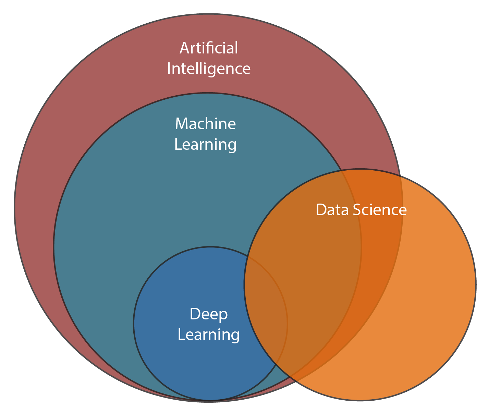

# 인공지능 vs 데이터 마이닝 vs 머신러닝

>  데이터 마이닝 (Data mining), 머신러닝(ML), 인공지능(AI)에 대해서 차이점을 명확하게 정리하겠다.

    

 

## 인공지능 (Artificial Intelligence)

> 기계학습을 뛰어 넘는 분석기법으로 시스템에 추론능력을 제공한다.

- 인간 지능의 한 단면을 기계가 모방한 시스템
- 이전의 패턴이나 지도를 보지 않고도 추론을 통해 구성요소들과 사건 간의 관계를 밝혀낸다.

 

## 데이터마이닝 (Data mining)

> 다양한 관점에서 **데이터를 분석해 의미를 도출** (데이터의 특징을 알아내는 것이 중점)

- 보유한 데이터를 다양한 관점에서 분석하고, 그 결과를 유용한 정보로 조합하는 일

- 방대한 데이터 속에 숨어있던 패턴과 상관성을 통계적 수법들로 식별하여 가치를 부여

- 숫자가 아닌 데이터도 처리한다는 점에서 통계처리와 구분

- '데이터 마이닝' 기법에는 일반적으로 **연관**(association), **회귀**(regression) 및 **분류**(classification)라는 세가지 유형이 있다.

  1. **연관 분석**:

     주어진 데이터 셋에서 자주 발생하는 속성값들을 연결해주는 연관 규칙을 발견하는 일

     (ex. 고객이 구매한 쇼핑카트 내의 개별 상품간의 상관관계 식별)

  2. **회귀 분석**:

     독립 변수 분석을 통해 종속 변수가 무엇인지 밝혀내는 일

     (ex. 어떤 상품의 예상 판매 실적을 두고 주요 고객들의 소득 수준과 상품의 판매가격과의 상관관계로부터 예측하는 방법)

  3. **분류**:

     개체들을 여러 카테고리로 나누는 일

 

## 머신러닝 (Machine Learning)

> 데이터 마이닝이나 기타 학습 알고리즘을 사용하여 지식을 추출하고 이를 **경험기반으로 삼아 비슷한 상황의 미래 사건의 결과를 예측**(현재 데이터를 가지고 학습 한 뒤, 미래를 예측하는 것에 중점)

- 인공지능의 한분야

- 데이터의 패턴을 발견하는 핵심 알고리즘이 동일하지만, 기계학습은 자체 학습 알고리즘을 사용하며 시간이 경과함에 따라 **경험을 축적하면서 작업 성능이 향상**된다.

- 데이터를 모델링하는 알고리즘은 여러가지가 있지만, 크게 **지도학습**(Supervised learning), **비지도학습**(Unsupervised Learning), **강화학습**(Reinforcement Learning)으로 분류

  1. **지도학습**: 

     - 결과를 알고있는, 즉 label이 있는 데이터를 바탕으로 예측하거나 분류하는 것

     - 회귀 분석(Regression), 분류(Classification)

  2. **비지도학습**:

     - label이 없는 데이터에서 패턴을 발견하고, 숨겨진 구조를 찾아내는 것
     - 군집화 (Clustering), 의사결정트리 (Decision Tree)

  3. **강화학습**: 

     경험과 시행 착오를 통해 얻어진 데이터를 기반으로 모델을 지속적으로 개선하는 방식으로, 설정된 환경 속에 보상을 주며 학습한다.

 

출처 및 참고:

[http://news.samsungdisplay.com/12538]()

[https://subscription.packtpub.com/book/data/9781838826321/1/ch01lvl1sec01/defining-ai]()