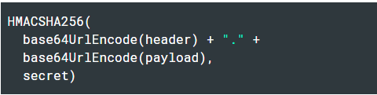
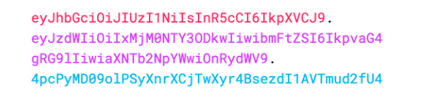

## JWT

> Json Web Token의 약자
>
> <u>토큰 기반의 인증 방식</u>에 사용
>
> 웹표준 RFC7519
>
> URL-safe -> HTTP헤더나 URL파라미터로 전달 가능

### 서버 기반 인증의 문제?

서버측에 유저 정보를 저장하는 방식 -> 대표적으로 세션

사용자 수가 증가할 경우 **메모리 과부하 문제** 발생 가능성 존재


### 토큰 기반 인증 

-----

#### 동작 방식

1. 사용자가 로그인
2. 서버 측에서 이를 처리하고 클라이언트에 인증된 토큰 발급
3. 클라이언트는 해당 토큰을 저장하고 요청마다 해당 토큰을 서버에 전달
4. 서버는 요청마다 해당 토큰을 검증


#### 장점

+ 뛰어한 확장성
+ 쿠키를 보내지 않으므로 쿠키의 취약성 해결
+ 다른 서비스와 인증 공유 가능 ex) OAuth

#### 단점

+ 토큰에 많은 **필드**가 추가될 경우 사이즈가 커질 수 있다.
+ 각 요청은 토큰을 포함하므로 트래픽에 영향을 끼친다.


### JWT에 대해 알아보자

-----


+ Header

  ```{
  {
  "typ": "JWT",
  "alg": "HS256"
  }
  ```

  + typ: 토큰의 타입
  + alg: 해싱 알고리즘
  + 위 JSON형태의 데이터를 Base64로 변환

+ Payload

  ```
  {
      "iss": "velopert.com",
      "exp": "1485270000000",
      "https://example.com/is_admin": true,
      "userId": "11028373727102",
      "username": "exmaple"
  }
  ```

  -> 토큰에 담을 정보가 들어있는 부분

  + iss: 토큰 발급자
  + exp: 만료시간
  + 이외 필요에 따라 필드 추가 가능
  + 위 JSON형태의 데이터를 Base64로 변환

+ 서명

  

  header의 인코딩 값과 payload의 인코딩 값을 합친 후 주어진 비밀키로 해쉬하여 생성

  

#### 실제  JWT의 예



### JWT 활용 범위

-----

+ 회원 인증
  + 위에서 언급한 내용과 같다.
+ 정보 교류
  - 두 개체 사이의 안정성있는 데이터 교환
  - 정보가 sign되어 있기 때문에 위변조 유무를 검증 가능


