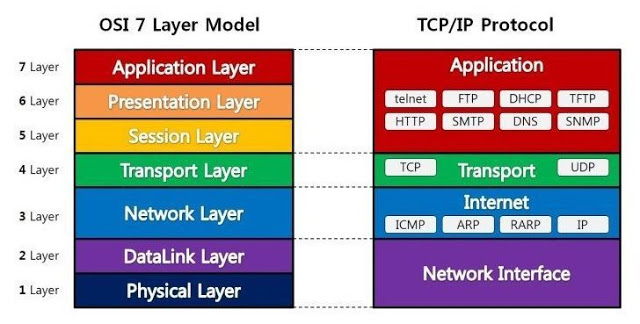
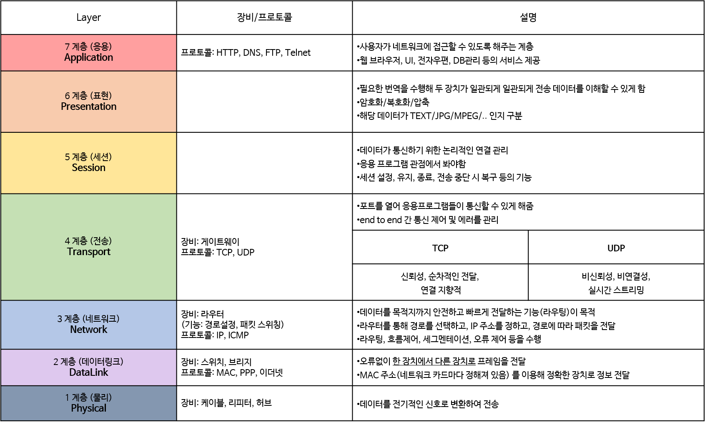

# OSI(Open System Interconnection) 7 계층

> 네트워크에서 통신이 일어나는 과정을 7단계로 나눈 것

### 7계층을 나눈 이유?

통신이 일어나는 과정을 단계별로 알 수 있고, 특정한 곳에 이상이 생기면 그 단계만 수정할 수 있기 때문

    

  

    

 

참고 및 출처: http://itnovice1.blogspot.com/2019/08/osi-7.html