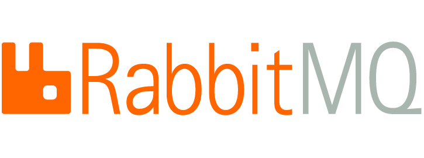

## RabbitMQ

> Erlang+JAVA 으로 AMQP를 구현한 메시지 브로커 시스템

### AMQP

클라이언트가 메세지 미들웨어 브로커와 통신하게 해주는 **메세징 프로토콜**

**브로커의 역할**

​	생산자 -> **[Exchange -- Binding -- Queue]** -> 소비자

 1. 생산자가 메세지를 **브로커의 Exchange**로 전달

 2. **Binding** 규칙에 따라 해당 Queue로 메세지 복사

 3. 소비자는 브로커의 **Queue**를 통해 메세지를 수신

    

**메세지 브로커 시스템**

+ **RabbitMQ** - 좀 더 성숙, 안전한 메세지 전달 보장 중심
+ **Kafka** - 엄청난 트래픽 처리
+ ActiveMQ
+ 기타 등등

RabbitMQ vs Kafka: https://hamait.tistory.com/405

### RabbitMQ란?

-----

**특징**

+ ISO 표준 **AMQP** 구현
+ 비동기처리를 위한 **메세지큐 브로커**
+ 분산처리를 고려한 MQ(클러스터)
+ 고가용성
+ Pub/Sub 방식 지원

**만약 한 큐를 여러 소비자가 Subscribe하는 경우?**

RabbitMQ는 병렬처리를 쉽게 할 수 있게 같은 Queue를 Subscribe하는 소비자에게 균등 분배

Round-Robin 방식으로 메세지를 전달한다.

반대로 여러 생산자가 같은 Queue에 Publish 하는 것도 가능!

-> **Scale out의 용이성 보장**

**메세지 수신 통보**

TCP와 같이 메세지 수신을 보장하기 위해 **ACK를 사용**

ACK가 회신된 메세지만 '처리완료'로 처리하고 삭제

**Exchange Type**

+ Direct exchange : 메세지에 명시된 **라우팅 키** 기반으로 Queue에 메세지 전달
+ Fanout exchange : 모든 큐에 메세지 전달
+ Topic Exchange : 라우팅 키 전체 혹은 일부 패턴과 일치하는 모든 큐에 메세지 전달
+ Headers Exchange : 메세지 헤더를 통한 바인딩 -> 좀 더 복잡한 속성을 사용