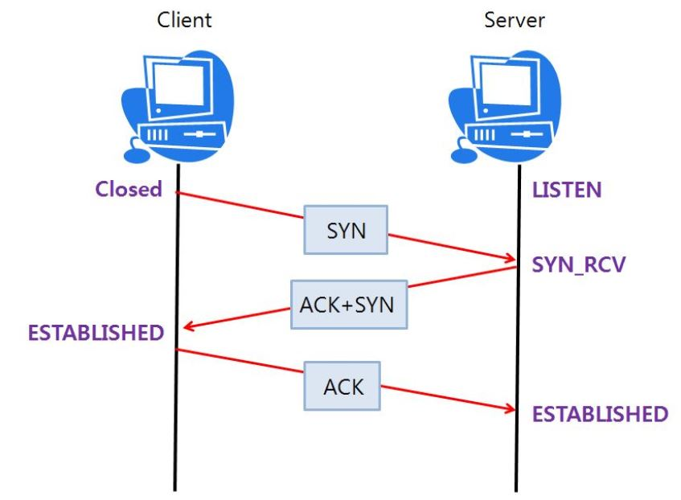
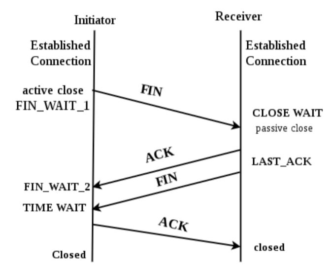
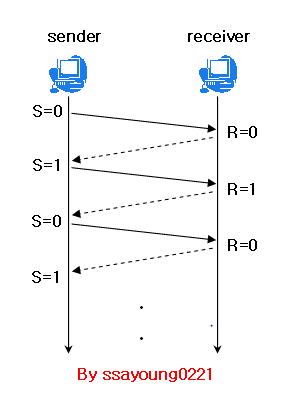
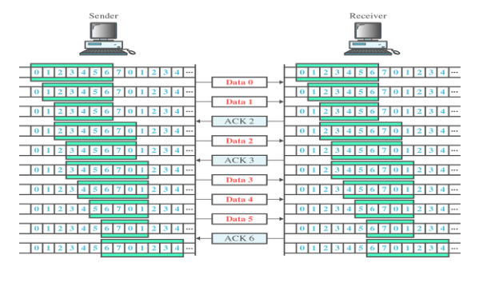

# TCP (전송 계층 프로토콜)

> 네트워크 통신에서 신뢰적인 연결 방식(전송 중 데이터가 소멸되지 않음을 보장)
>
> 비신뢰적인 네트워크에서 **신뢰적인 네트워킹을 보장할 수 있도록 하는 프로토콜**
>
> 전송 순서대로 데이터를 수신하며 데이터의 경계가 없음
>
> 1:1의 소켓 연결 구조 

### **3 way handshake**

<u>통신하기 앞서</u>, 논리적인 접속을 성립하기위해 3 way handshake 과정을 진행한다.

**Server:** 포트가 열린 상태로 연결 요청 대기중 (LISTEN)

**Client:** 포트가 닫힌 상태 (Closed)

출처: https://hyeonstorage.tistory.com/286

1.  Client에서 Server에 연결 요청을 하기위해 SYN(동기화) 패킷을 보낸다.

2. Server의 해당 포트는 SYN 패킷을 받고 SYN_RCV(동기화 패킷 받음)으로 상태가 변경된다. 
   그리고 ACK (정상적으로 받음)와 Client도 포트를 열어달라는 SYN를 같이 보낸다.

3. Client가 ACK+SYN을 받고 ESTABLISHED로 상태를 변경하고, 서버에 요청을 잘 받았다는 ACK를 전송한다. ACK를 받은 서버는 ESTABLISHED로 변경된다.

   

---------------

### **4 way handshake**

<u>통신을 해제</u>하기 위해 4 way handshake 과정을 진행한다.

Server와 Client 모두 ESTABLISHED 상태

1. Client는 Server에게 FIN(연결종료)을 보낸다.
2. Server는 FIN을 받고, 확인했다는 ACK를 Client에게 보낸다. 
3. 데이터를 모두 보내면, FIN을 Client에게 보낸다.
4. Client는 FIN을 받고, 확인했다는 ACK를 서버에게 보낸다. 
   (서버로 부터 아직 받지 못한 데이터가 있을 수 있어 TIME_WAIT로 대기) 
5. 이후 둘다 Closed => 연결해제

## TCP 흐름제어

> TCP는 신뢰성있는 전송을 보장
>
> 흐름제어 기법은 TCP의 신뢰성을 보장해주는 수단 중 하나
>
> 송수신 측의 데이터 처리 속도 차이로 발생하는 <u>문제</u>를 해결
>
> 수신측이 주체

#### 어떤 문제?

1. 각 소켓은 I/O 버퍼를 가지고 있다.
2. 각 버퍼의 용량에는 한계가 존재한다.
3. 만약 송신자의 처리 속도가 수신자보다 빠를 경우에는?
4. 언젠가 수신자의 버퍼는 꽉차게 되고 나머지 데이터는 손실 ~~신뢰성의 TCP~~ 

*****

### 방식

1. Stop and Wait 방식
2. **Windowing 방식**

*****

#### Stop and Wait

Timeout 시간안에 ACK가 도착하면 그 다음 데이터를 전송

하나 받고 하나 보내는 방식이기 때문에 **비효율적**

*****

#### Windowing 방식 (Sliding Window) 

> 하나씩 보내는 Stop-and-Wait와 달리 여러 데이터를 한번에 보내는 방식
>
> 수신 측의 윈도우 크기만큼 송신 측에서 확인 응답 없이 데이터를 전송
>
> 수신자의 여유 버퍼에 따라 윈도우를 크기를 동적으로 제어

TCP/IP를 사용하는 호스들은 Receive/Send 윈도우를 보유

3-way handshaking 과정에서 각 호스트는 서로의 window 크기를 공유하여 

수신자의 Receive window 크기에 송신자의 Send window크기를 맞춤

1. 윈도우에 포함되는 모든 패킷을 일단 전송
2. 수신자는 해당 패킷을 받았다고 송신자에게 ACK
3. 송신자가 ACK를 받으면 그만큼 윈도우를 이동시켜 다른 패킷을 전송
