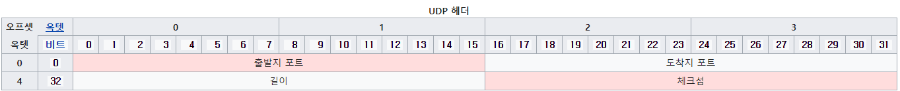

# UDP (전송 계층의 프로토콜)

### User Datagram Protocol

### Connection-less

### Unreliable

### 1:N 연결 가능

***

> UDP는 TCP의 흐름제어, 혼잡제어 등의 기능을 생략한 단순한 통신 기법
>
> 그로 인해 **데이터그램** 의 전송 순서가 일정하지 않고 손실의 가능성도 존재
>
> 하지만 **TCP보다 빠르고 오버헤드가 적다는 장점**
>
> *****
>
> + 비연결형 서비스
>   TCP의 3-way handshaking이 아닌 포트만 알면 바로 송신
>   (연결의 유무도 따지지 않는다)
>
> + 빠른 속도
>
>   
>
>   TCP의 헤더와 비교해서 최소 2배 이상 차이날 정도로 단순한 구조의 UDP헤더(8 Byte)
>   그 만큼 다양한 기능을 포기하고 전송 속도를 얻었다.
>
> + 비신뢰성
>
>   흐름제어, 혼잡제어 등이 존재하지 않음
>   하지만 최소한의 오류 제어는 실시(헤더의 checksum 필드를 활용)
>
>   ACK도 없어 무사히 도착했는지도 모른다
>
>    ~~무책임하다~~

*****

#### 활용 분야

1. 빠른 전송 속도가 필요하거나
2. 데이터 몇개 소실된다고 문제가 되지 않거나
3. 신뢰성보다는 연속성, 실시간성이 중요할 때

+ 스트리밍 서비스
+ 영상 통화
+ VoIP
+ 온라인 게임 외 등등..