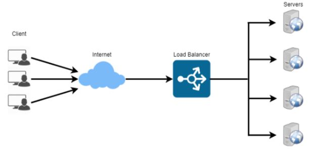

# 로드 밸런싱

> 둘이상의 CPU/저장장치와 같은 컴퓨터 자원들에게 작업을 나누는 것으로 **부하분산**이 목적
>
> 이를 통해 **가용성 및 응답시간을 최적화**할 수 있다

* **여러 서버에게 균등하게 트래픽을 분산**시켜주는 것이 로드밸런싱이다.
* 트래픽에 대응하기 위한 방법
  1. **하드웨어 성능(CPU/Memory 자원)을 높이거나 낮춤** (scale-up / scale-down)
  2. **여러대의 서버가 나눠서 일하도록 만드는 것 (scale-out / scale-in)** 하는 것이 있다. 
* 로드밸런싱은 분산식 웹 서비스로, 여러 서버에 부하를 나누어준다. 로드밸런서를 클라이언트와 서버사이에 두고, 부하가 일어나지 않도록 여러 서버에 분산시켜준다. 
* 로드밸런서가 서버를 선택하는 방식
  1. 라운드 로빈
  2. Least Connections: 연결 개수가 가장 적은 서버 선택
  3. Source: 사용자 IP를 해싱하여 분배

- 로드밸런서 장애 대비: 로드밸런서를 이중화하여 대비하기도 한다.
