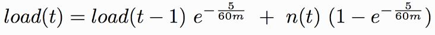

# CPU Load

> Load의 사전적인 정의는 부하량이다. 쉽게 이해하자면 Task가 처리되기를 기다리는 정도를 표현한 값이라 할 수 있다.

### Ⅰ. CPU Load vs CPU 사용률

비슷한 의미를 가지고 있지만 Load는 남아있는 작업에 대한 정보를 포함하고 있다.

 

### Ⅱ. CPU Load란?

CPU에 실행중이거나 대기중인 작업의 개수를 평균적으로 보여주는 값이다. 

* CPU 사용률로 알 수 없는 남아있는 작업을 표시한다.

* 작업 순간의 값이 아닌 시간 동안의 평균값을 나타낸다.

  > 리눅스의 경우 uptime 명령어를 사용하면 알 수 있으며 1분, 5분, 15분의 평균값을 알수 있음

* CPU 코어 수에 비례한다.

  > 예시)
  >
  > * 대기 중인 프로세스가 없는 코어가 1개인 CPU : CPU Load = 1
  > * 대기 중인 프로세스가 없는 코어가 2개인 CPU : CPU Load = 2 

 

### Ⅲ. Load Average 계산 방법

특정 시점에서 전체 처리량의 평균값을 저장하는 것이 아닌 이전 시점의 평균 값을 참고하여 계산하는 방법을 이용

* **Linux 에서의 계산 : Exponetial Moving Average 방식**

  

  > m : reporting 하기 위한 시간이다. (Linux에서는 1분, 5분, 15분)
  >
  > load(t) : 현재의 load 값
  >
  > load(t-1) : 지난 load 값
  >
  > n(t) : 현재의 active한 process 수

 

### Ⅳ. Load Average 판단 방법

일반적으로 코어가 1개인 CPU의 경우 Load Average가 0.7정도의 값이라면 원활한 상태라고 생각한다.