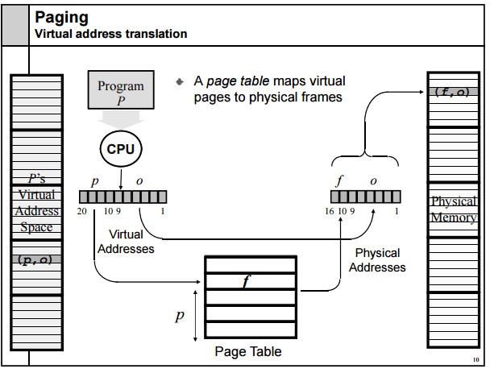

# 메모리 (Memory)

> **메모리 관리의 목표?**
>
> 프로그래밍을 할 때 쉽게 메모리를 사용할 수 있도록 abstraction을 제공
>
> 한정된 메모리 자원을 효율적으로 관리
>
> 프로세스 간 서로가 사용하고 있는 메모리를 침범하지 못하도록 막음 (메모리 보호)

### 메모리 관리 기법

1. 연속 메모리 관리 기법

   > 하나의 프로그램을 쪼개지 않고 메모리 공간에 연속적으로 할당

   - **고정 분할**

     - 메모리 공간을 고정된 사이즈로 잘라 프로그램을 배치하는 기법

     - 내부 단편화 발생 (ex. 250M 단위로 프레임을 나누고, 프로그램 사이즈가 990M라고 할 때 프로그램은 4칸의 프레임을 연속적으로 사용하고 10M만큼의 내부 단편화가 발생한다.)

   - **동적(=가변) 분할**

     - 메모리 공간을 프로그램 메모리 크기만큼을 할당하여 배치하는 기법
     - 외부 단편화 발생 (ex. 프로세스들이 메모리에 적재되고 제거되는 일이 반복될 때, 사용하기에 애매한 크기의 메모리들이 생길 수 있음)

   

2. 불연속 메모리 관리 기법

   > 프로그램을 쪼개서 메모리 공간에 불연속적으로 할당

   - **페이징 (Paging)**
     - 물리메모리는 **Frame**이라는 고정 크기의 블록으로, 가상 메모리는 **Page**라는 고정 크기의 블록으로 잘라 프로그램을 배치
     - 물리 메모리에 저장할 때, 연속되어 저장될 필요가 없고 남는 프레임에 적절하게 배치되기 때문에 외부 단편화가 발생하지 않는다.
   - **세그멘테이션 (Segmentation)**
     - 서로 다른 크기의 논리적 단위인 **Segment**로 잘라 프로그램 배치
     - 내부 단편화가 발생하지 않는다.

---------------

### 가상메모리 (Virtual Memory)

> 프로세스 전체가 메모리 내에 올라오지 않더라도 실행이 가능하도록 하는 기법

**하는일**

- 실제 올라가는 물리 메모리와 사용자의 논리 메모리 개념을 분리하여, 상대적으로 작은 물리메모리로도 큰 가장주소공간을 프로그래머에게 제공

- `요구 페이지 기법`을 사용하여 필요한 페이지만을 물리메모리에 적재

  

**페이지 테이블 (Page Table)**

- 프로세스의 페이지 정보를 저장하고 있는 테이블
- **p**: 가상 메모리에 참조될 항목이 속해있는 page 번호 (page #)
- **d**: page offset 
- 2단계 페이징 기법, 역페이지 테이블 등 다양한 방식이 있음

**주소 변환 기법**

- CPU가 사용하는 논리적 주소를 페이지 번호와 페이지 오프셋으로 나누어 주소 변환에 사용
- 페이지 번호는 페이지 테이블의 인덱스로 사용되고, 해당 인덱스의 항목에는 그 페이지의 물리적 메모리 상의 기준 주소가 저장

참고 및 출처: [https://velog.io/@pa324/%EC%9A%B4%EC%98%81%EC%B2%B4%EC%A0%9C-%EB%A9%94%EB%AA%A8%EB%A6%AC-%EA%B4%80%EB%A6%AC-l5k3qktzwo](https://velog.io/@pa324/운영체제-메모리-관리-l5k3qktzwo)

-----------------

### 캐시메모리 (Cache Memory)

> 메인메모리에 저장된 내용의 일부를 임시로 저장해두는 기억장치

- CPU와 메인메모리의 속도차에 따른 병목 현상을 줄이기 위한 범용 메모리
- CPU가 읽은 내용을 다시 접근할 때, 메모리 참조 및 인출과정에 대한 비용을 줄이기 위해 캐시에 저장해둔 데이터를 활용

* **CPU가 어떤 데이터를 원할 것인가에 대한 예측이 중요**

**지역성의 원리**

>  `Hit Rate (적중률)`을 높이기 위해 사용하는 방법

- 시간 지역성: 최근에 참조된 주소의 내용은 곧 다음에 다시 참조되는 특성

- 공간 지역성: 대부분의 실제 프로그램이 참조된 주소와 인접한 주소의 내용이 다시 참조되는 특성

  

CPU에서 주소를 전달 → 캐시 기억장치에 명령이 존재하는지 확인

있다면) **HIT**: 해당 명령어를 CPU로 전송

없다면) **MISS**: 명령어를 가지고 메모리로 접근 → 해당 명령어를 가진 데이터 추출 → 해당 명령어 데이터를 캐시에 저장 → 명령어를 CPU로 전송