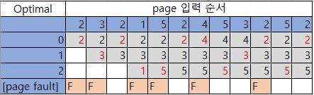
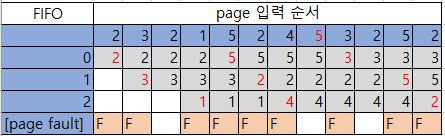
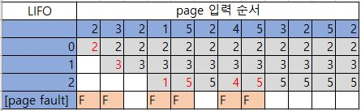
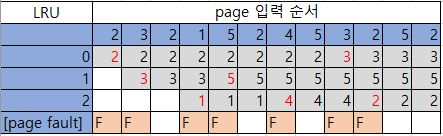
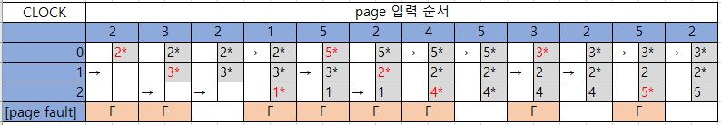

## 페이지 교체 알고리즘 (Page Replacement Algorithm)

> 주기억장치에 더이상 사용공간이 없을 때, 현재 적재되어 있는 페이지 중 어떤 페이지를 교체시킬지를 결정

 

### Ⅰ. 페이지 교체 기법의 종류

#### 	1. OPT (Optimal)

* 미래에 참조될 때까지의 시간이 가장 긴 페이지를 교체 대상으로 선택

* OS가 미래에 일어날 사건들에 대해 완벽히 알 수 없기 때문에 사실상 구현 불가능

 

### 2. FIFO (First-In-First-Out)

* 가장 오래 전에 반입된 페이지를 교체 대상으로 선택

* **FIFO의 이상 현상 (FIFO Abnormaly)**

  * Locality를 고려하지 않았기 때문에 발생하는 현상

  * page frame을 증가시켜도 page failt가 오히려 증가하는 현상

    > locality란? 기억 장치 내의 정보를 균일하게 접근하는 것이 아닌 특정 부분만 집중적으로 참조하는 특성

* 구현 하기는 용이하나 상대적으로 성능이 좋지 않음

 

### 3. LIFO

* 가장 최근에 반입된 페이지를 교체 대상으로 선택

  

 

### 4. LRU (Least Recently Used)

* 가장 오랜 동안 참조되지 않은 페이지를 교체 대상으로 선택

  

* Optimal과 유사하게 동작하지만 오버헤드가 크기 때문에 사실상 구현 불가능

 

### 5. CLOCK 

> NRU (Not Recently Used)라 불리기도 한다.

* LRU를 구현하기 위한 근접한 알고리즘으로, 가장 단순한 형태는 각 프레임에 **use bit**를 연계해 사용

* **교체 순서**

  1) 해당 페이지가 참조되면 use bit = 1로 설정

  2) 포인터로 교체 후보를 가르킴

  3) 페이지가 교최될 경우 포인터는 교체된 다음 페이지를 가리킴

  4) page fault가 일어날 시, 포인터에서 부터 use bit = 0 인 프레임을 찾아 교체

  > 이 당시 use bit = 1 인 프레임을 만나면 0으로 변경 후 다음 프레임 점검
  >
  > 모든 use bit = 1이라면 한 바퀴를 선회 후 원래 위치에 멈추고, 그 페이지를 교체 대상으로 선택

  

------

