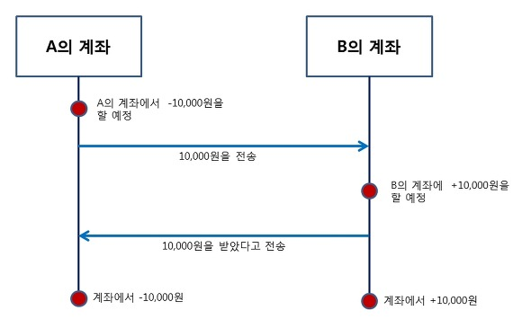
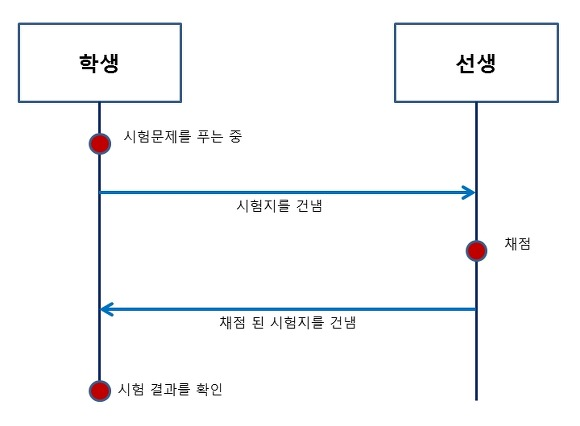

# 프로세스 병행성 (Process Concurrency)

> 여러개의 프로세스(또는 스레드)가 동시에 실행되는 시스템의 특성

## 프로세스 동기화 (Process Synchronization)

> **프로세스 동기화란?**
>
> 프로세스를 병행(concurrency)으로 실행할 때, 실행 순서 규칙을 정하여 **공유 자원의 일관성을 보장**하기 위해 규칙을 만드는 것

 

### 동기: synchronous(동시에 일어나는)

- 요청과 결과가 한자리에서 동시에 일어나야 함

- A노드와 B노드 사이의 트랜젝션(작업 처리 단위)를 동시에 맞추겠다!

  예) **A가 B에게 10000원 송금**

A 계좌에서 B 계좌에 돈을 넣을 때 A와 B는 같은 일을 했고, 두 계좌에서 발생한 차감과 증가가 동시에 발생

=> 따라서 동기

 

### 비동기: asynchronous (동시에 일어나지 않는)

- 요청과 결과가 동시에 일어나지 않으며, 요청한 그자리에서 결과가 주어지지 않음

- 노드 사이의 트랜젝션을 동시에 맞추지 않아도 된다!

  예) **시험날의 학생과 선생**

  

학생이 푼 시험지를 선생에게 전송하여 결과를 확인하는 시스템으로 굳이 동시에 할 필요가 없음

=> 따라서 비동기

> ***블록(block) vs 논블록(non-block)***
>
> 학생이 시험지를 건넨 후 가만히 앉아 채점이 끝나고 시험지를 돌려받는 것을 기다린다면 **블록 상태**
>
> 학생이 시험지를 건넨 후 다시 돌려받기 전까지 다른 과목을 공부하거나 일 등을 하게 되면 **논블록 상태**

 

## 임계영역 (Critical Section)

> 공유 자원에 접근하는 각 프로세스 내부의 코드 영역으로, **다른 프로세스가 해당 코드 영역을 수행하는 동안 수행하지 않아야 하는 코드 영역**

* 임계영역은 시간이 지나면 종료되며, 어떤 프로세스가 임계영역에 접근하기 위해서는 지정된 시간 만큼 대기해야 한다. 

* 쓰레드나 프로세스가 배타적인 사용권을 보장받기 위해 세마포어같은 동기화 메커니즘이 사용된다.

 

### 임계영역 문제 (Critical Section Problem)

프로세스들이 임계영역을 함께 사용할 수 있게 설계하는 것

* **해결하기 위한 기본 조건 (Requirement)**

  1. **상호배제 (mutual exclusion)**

     > 한 프로세스가 공유 자원에 접근하는 임계영역 코드를 수행하고 있는 경우, 
     > 다른 프로세스들은 각자의 임계영역 코드를 수행할 수 없다는 조건

  2. **진행 (Progress)**

     > 임계영역에서 실행중인 프로세스가 없고, 별도의 동작이 없는 프로세스들만
     > 임계영역 진입후보로서 참여할 수 있다.

  3. **한정된 대기 (Bounded Waiting)**

     > 한 프로세스가 임계영역에 진입하기 전까지, 다른 프로세스들이 임계영역에 진입하는 횟수는 제한이 있어야한다.

* **해결 방법**

  뮤텍스(=바이너리 세마포어) - boolean (상태)

  세마포어 - int (카운터)

 

## 교착상태 (deadlock)

> 두 개 이상의 프로세스들이 서로 다른 프로세스가 어떤 일을 해 줄 때까지 기다리고 있어,
> 관련 프로세스 모두가 더 이상 진행할 수 없는 상태

* **발생 조건**

  > 4가지가 **모두 성립**해야 발생한다

  1. 상호배제 (Mutual exclusion) : 자원은 한번에 한 프로세스만 사용 가능

  2. 점유대기 (Hold and wait): 자원을 기다리는 프로세스가 이미 다른 자원을 할당하고 있다.

  3. 비선점 (No preemption): 프로세스에 할당된 자원은 사용이 끝날 때까지 강제로 뺏을 수 없음

  4. 순환대기 (Circular wait): 프로세스의 집합에서 **순환 형태로 자원을 대기**

     

> 자원 할당 그래프를 파악하여 해당 그래프가 교착상태인지 파악하는 것이 가장 중요

 

## 그 외 병행성 관련 중요 용어

- **경쟁조건 (race condition)**

  > 두 개 이상의 프로세스가 공유 데이터 항목을 읽고 쓰는 상황으로, 최종 수행 결과는 프로세스들의 상대적인 수행 순서에 따라 달라질 수 있다.

* **기아 (starvation)**

  > 스행 가능한 프로세스가 스케줄러에 의해 무한정 간과되고 있는 상황
  > **(수행 가능하지만 선택되지 않는 상황)**

  

그림 출처:https://private.tistory.com/24  

참고: https://chogyujin-study.tistory.com/8  
          https://rebas.kr/856

