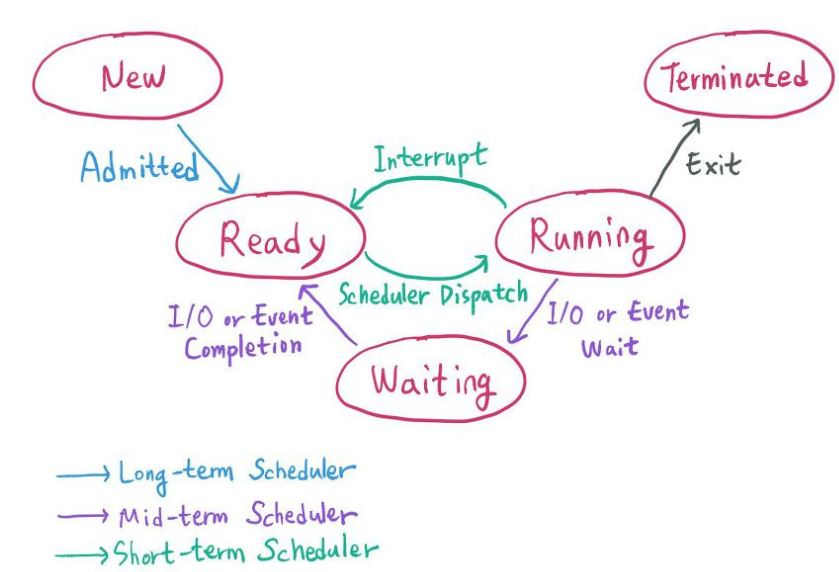

# 스케쥴링 (Scheduling)

> CPU를 효율적으로 사용하기 위해 프로세스들 사이의 우선 순위를 관리

## 스케쥴러의 목적

* 처리율/CPU이용률 ↑

- 오버헤드/응답시간/반환시간/대기시간 ↓

 

## 프로세스 스케쥴러(Process Scheduler) 

OS의 일부로, 특정 시점에서 어떤 프로세스가 실행될지 결정한다.

출처: https://rebas.kr/860

 

1. **장기 스케쥴러 (Long-term/admission scheduler)**

   > 어떤 프로세스를 메모리에 할당하고 READY QUEUE로 보낼지 결정

   디스크 내의 작업을 어떤 순서로 메모리에 가져올지 결정하는 프로그램

2. **중기 스케쥴러 (Medium-term scheduler, Swapping)**

   > Memory에서 프로세스를 일시적으로 제거하여 Disk에 배치 혹은 그 반대로 배치
   > (Swap-in, Swap-out)

   많은 프로세스들이 한번에 메모리에 올라왔을 때 디스크에 임시로 저장되는데, 이때 <u>어떤 프로세스를 메모리에 할당할지</u> 결정한다.

3. **단기 스케쥴러 (Short-term scheduler, <u>CPU scheduler</u>)**

   > READY QUEUE에 존재하는 프로세스 중 어떤 프로세스를 RUNNING 시킬지 결정

   CPU와 메모리 사이의 스케줄링을 담당하며, <u>프로세스에 CPU를 할당</u>한다 (**scheduler dispatch**). 이때, 프로세스를 CPU에 할당한다.

 

## CPU 스케쥴링 알고리즘

READY QUEUE에 존재하는 프로세스 중 하나를 선택해 CPU를 할당하는 것 (*단기 스케쥴러)

### 비선점(Non-Preemptive) 스케쥴링

> 프로세스가 CPU를 놓아주는 시점(프로세스 종료, I/O 이벤트 등)에만 스케쥴링이 일어남

* **FIFO/FCFS (First In First Out/First Come First Served)**

  프로세스들이 READY QUEUE에 도착한 순서대로 CPU 할당

  문제점: 수행시간이 긴 프로세스가 먼저 도달할 경우 효율성이 낮다

* **SJF (Shortest Job First)**

  QUEUE 안에 있는 프로세스 중 수행시간이 가장 짧은 것 먼저 수행하며, 평균 대기시간을 감소시킴

  문제점: 수행시간이 긴 프로세스가 CPU 할당을 받기 쉽지 않다 (starvation)

* **Priority Scheduling**

  우선순위가 가장 높은 프로세스에게 CPU를 할당하는 방식

  문제점: CPU를 사용하지 못하는 프로세스 무기한 대기

  해결 방법: 우선순위가 낮은 프로세스 중 대기시간이 긴 프로세스는 우선순위를 높여줌

 

### 선점(Preemptive) 스케쥴링

> 특정 프로세스가 CPU 점유 중일 때, 우선순위가 높은 프로세스가 강제로 CPU를 차지할 수 있음

* **SRT(Shortest Remaining time First)**

  QUEUE에 들어오는 프로세스 중 수행시간이 가장 짧은 프로세스가 CPU를 할당받는 방식으로, 수행시간이 더 짧은 프로세스가 READY QUEUE에 있거나 들어오면 바로 그 프로세스가 선점된다. 

  문제점: starvation

* **Round Robin**

  프로세스가 모두 같은 크기의 CPU 시간(time quantum)을 할당받고, 할당 시간이 지나면 다음 프로세스가 순서대로 선점한다. 이때, 수행시간이 모두 끝나지 않았다면 READY QUEUE에 다시 줄을 서 대기한다.

  문제점: 할당 시간이 너무 크면 FIFO방식과 같고, 너무 작으면 오버헤드가 커짐

* **Multi-level Queue**

  READY QUEUE를 2개 이상 사용하는 기법으로, 각각의 큐는 자신의 스케쥴링을 수행하며 큐끼리에도 우선순위가 부여된다.

* **Multi-level Feedback-Queue**

  Multi-level Queue와 비슷하지만, 프로세스들이 특정 큐만 사용하지 않고 조건에 맞게 큐에 배치

 

## 스레드 스케쥴링

스레드 스케쥴링 전에 ***경쟁 범위*** 에 대해서 먼저 알아보자

- **프로세스 경쟁 범위**: 프로세스 내 유저 스레드 간의 경쟁 범위로, *하나의 커널 스레드를 두고 여러개의 유저 스레드가 경쟁하는 것*
- **시스템 경쟁 범위**: 시스템 내 커널스레드 간의 경쟁범위로, *하나의 CPU를 두고 여러개의 커널 스레드가 경쟁하는 것*

스레드 스케줄링에서 스레드의 의미는 유저 스레드를 의미 한다. 즉 CPU에서 실행되고 있는 커널 스레드는 변하지 않지만, 해당 **커널 스레드 위에서 *경량 프로세스* 에 의해 실행되고 있는 유저 스레드의 전환을 어떻게 할지에 대한 문제를 다루는 것이 스레드 스케쥴링**이다.

> **커널 레벨 스레드 vs 유저 레벨 스레드**
>
> 커널 레벨 스레드는 OS가 관리하는 스레드들이고, 유저 레벨 스레드는 프로그래밍 과정에서 스레드를 코드에 적는 것이라고 이해하면 된다.

출처: [https://devsophia.tistory.com/entry/CPU-스케쥴링]()