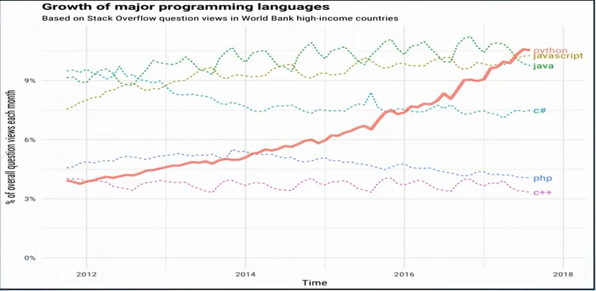

# 파이썬

- 1991년 귀도 반 로섬에 의해 만들어진 언어
- 최근 가장 많이 사용되고 빠르게 확산 중
- 쉽고 직관적인 문법 → 러닝 커브가 적은 언어
- 높은 생산성
- 인터프리터 방식
- 3.x 버전에 들어가며 하위 호환성을 과감히 포기(2.x와 호환 X)
- 동적 타입 (C, JAVA 등은 정적 타입)
  ``
  a = 5
  a = "파이썬"
  ``

---

### 파이썬은 싱글스레드?

파이썬의 **GIL(Global Interpreter Lock)**
: 하나의 프로세스 안에 모든 자원을 하나의 락으로 관리

**-> 대부분의 멀티 스레딩은 오히려 성능 저하를 야기**

### 어떻게 병렬 처리를 구현하나?

1. CPU bound task에는 멀티 프로세싱을 사용`fork()`
2. 혹은 asyncio같은 라이브러리를 이용
3. **I/O bound task(네트워크, 파일)**에는 멀티스레드 활용
   GIL이 적용되는 것은 CPU 동작까지만 이므로 I/O에는 멀티 스레드 수행 가능

### 그런데 왜 GIL을 채택했을까?

> 인터프리터의 구현이 쉬워진다
>
> G.C 만들기 좋다
>
> 그 당시에는 스레드 개념이 생소했다.
>
> 기타 등등.. 
> https://dgkim5360.tistory.com/entry/understanding-the-global-interpreter-lock-of-cpython