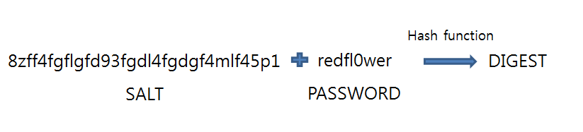

## Salt

> 패스워드에 소금(Salt)를 쳐서 더 안전하게 보관해보자!


**보통 사용자 패스워드를 저장하는 방식**

+ ~~그냥 텍스트로~~ 

+ 단방향 해시 함수(MD5, SHA 등)를 이용한 다이제스트 생성

  ex) SHA-256을 이용한 예시

  ```SHA-256
  hash(haraorum) = "fbdac9369b9c1c8bdfdc030488dceff951350ff6c182a91019457e9cd3c5a68f"
  ```

  여기서 한글자만 추가해도

  ```
  hash(haraorum1) = "d07c2e4588da9b05651de6abe4b3c4bd8da351188839a8a565137d7333c1dd82"
  ```

  라는 전혀 다른 다이제스트가 생성됨을 알 수 있다. - avalanche 효과


이러한 해싱 함수의 특성에 따라 Salt기법이 등장했다.


### Salt



**임의의 Salt값**을 해싱하고자 하는 데이터와 합쳐 다이제스트를 생성한다.

+ SALT값은 고정 값이 아닌 각 데이터 마다 랜덤 값을 가져야 안전
+ 솔트는 32byte 이상이어야 솔트와 다이제스트를 추측하기 어려움
+ DB에 생성된 다이제스트를 패스워드라고 저장, SALT값도 별도 저장


### 키 스트레칭

> 브루트 포스 어택으로 부터 패스워드 추측을 어렵게 하는 방식

1. 패스워드의 다이제스트를 생성
2. 다이제스트로 또 다른 다이제스트를 생성
3. 이를 N회 반복해 보안을 강화하는 방식


**Adaptive Key Dreivation Functions**

> adaptive key derivation function은 다이제스트를 생성할 때 솔팅과 키 스트레칭을 반복하며 솔트와 패스워드 외에도 입력 값을 추가하여 공격자가 쉽게 다이제스트를 유추할 수 없도록 하고 보안의 강도를 선택할 수 있다.

예시

+ PBKDF2
+ bcrypt
+ scrypt 등

-----

참고 : https://d2.naver.com/helloworld/318732