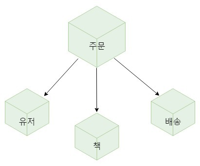

## MSA 아키텍처

> Micro Service Architecture의 준말
>
> 하나의 어플리케이션을 작은 어플리케이션들로 쪼갠 구조
>

**VS Monolithic Architecture**

: 소프트웨어의 모든 구성요소가 한 프로젝트에 통합되어있는 형태


**M.A의 문제점**

+ 빌드, 테스팅, 배포 시간이 프로젝트 규모에 따라 기하급수적으로 증가

+ 서비스 부분 적으로 Scale-out의 어려움

+ 서비스 부분 장애가 전체 시스템 장애로 이어질 수 있음

  

### Micro Service의 정의


````
 the microservice architectural style is an approach to developing a single application as a suite of 'small services, each running in its own process' and communicating with lightweight mechanisms, often an HTTP resource API. These services are built around business capabilities and 'independently deployable' by fully automated deployment machinery. 
 - Matin Folwer -
````

+ 스스로 동작 가능해야 한다.
+ 독립적으로 배포가 가능해야 한다.


**MSA의 장점**

+ 서비스 별 개별 배포 가능

+ 특정 서비스에 대한 부분적 Scale-out이 용이 -> 클라우드 사용에 적합

+ 부분적 장애에 대한 격리가 수월

+ 폴리글랏 아키텍처 구성이 가능

  ex) TPS높고 Read 작업이 많은 서비스 -> Node + Redis로 구성

  ​       트랜잭션 및 안정성 중요 -> Spring + RDBMS


**MSA의 단점**

+ Monolithic에 비해 복잡한 아키텍처 -> 서비스 간 통신이 필요하므로 Latency 증가
+ 데이터 관리의 어려움 -> 데이터가 여러 서비스에 분산되어 있어 통합 조회가 어려움
+ 성능 이슈


**MSA 경계의 기준**

+ 자율적 서비스
+ 배포 단위 크기
+ 폴리글랏 아키텍처
+ 선택적 확장 등..


### 서비스간 상호작용 예




**1. 동기적 작용**

ex) 주문 시 유저와 책 정보가 필요

REST/JSON  통신


**2. 비동기적 작용**

ex) 주문 시 배송 서비스에 해당 정보 전달

MQ 프로토콜 사용


출처 : https://alwayspr.tistory.com/20