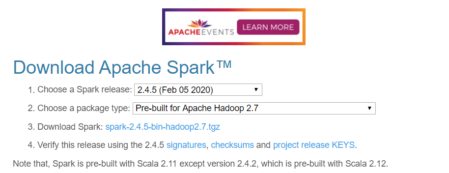

## Spark를 위한 개발환경 설정 for Windows10

### 필수 설정 조건

1. java 8 버전 이상의 jdk
2. Scala 설치하기
3. Spark 설치하기
4. Hadoop 설치하기
5. 환경변수 설정하기

------

이미 java 8버전 이상 설치되어있어 Scala부터 설치하기 시작했습니다. 


### 1. Scala 설치


[설치 링크]: https://www.scala-lang.org/download/

링크로 들어간 후 아래로 내리다 보면 다음과 같은 화면을 만날 수 있습니다. 


**Download the Scala binaries for windows** 클릭하면 <u>scala-2.13.2.msi</u> 파일이 다운로드 됩니다.

```c++
주의할 점은 경로 사용 시 C:\Program Files 경로가 아닌 새로운 폴더 C:\scala를 설정하여 설치합니다.
```

*(spark에서 경로 설정 시 띄어쓰기가 문제가 된다고 합니다.)*


### 2. Hadoop 설치


[설치 링크]: https://github.com/steveloughran/winutils

1) git을 사용하시는 경우에는 clone 하여 받으시면 됩니다. 

2) git을 사용하시지 않는 경우에는 해당 링크에 접속해 zip으로 download합니다. 

```c++
압축해제 후 
1. 새로운 폴더 C:\hadoop\bin 생성
2. 원하는 버전인 hadoop-2.7.1\bin\winutils.exe 의 파일을 복사해 C:\hadoop\bin에 붙여넣습니다.   
```

   

*위의 파일을 복사합니다.*

 

*해당 파일을 C:\hadoop\bin 에 붙여넣습니다.*


### 3. Spark 설치


[설치 링크]: http://spark.apache.org/downloads.html

링크에 접속하면 Spark와 Hadoop 버전을 선택 후 다운로드 받을 수 있습니다. 



**hadoop2.7** 버전에 맞는 **Spark 2.4.5** 버전을 다운받았습니다.  

```
주의할 점은 새로운 폴더 C:\scala-2.4.5를 설정하여 설치합니다.
```


### 4. 환경변수 설정


총 5개의 환경변수 설정을 해주었습니다. 환경번수 설정은 시스템 변수에서 이루어져야 합니다.


추가해야할 변수는 다음과 같습니다.

```javascript
1. HADOOP_HOME >> C:\hadoop
2. SCALA_HOME  >> C:\scala
3. SPARK_HOME  >> C:\spark-2.4.5
4. JAVA_HOME   >> C:\Program\java\jdk1.8.0_221    #jdk의 경로를 설정합니다.
5. JAVA_OPTIONS>> -Xmx512M -Xmx512M
```


### 설정 완료 후 Spark-Shell 실행 및 확인


1) Windows의 cmd를 실행시킵니다.

 


2) 다음의 위치로 이동합니다. 

```shell
C:\User >cd C:\spark-2.4.5\bin
```


3) 명령어를 실행합니다.

```shell
C:\spark-2.4.5\bin>spark-shell
```

 

위의 화면처럼 spark가 실행되는 것을 확인할 수 있습니다. 